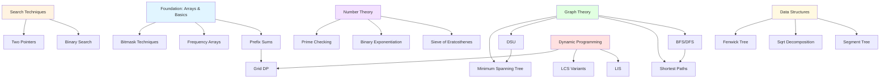

# 🚀 Competitive Programming Notebook & Topic Library


Welcome to my **Competitive Programming Notebook**!  
This repository is a curated collection of algorithms, data structures, templates, and problem-solving patterns that I actively use in competitive programming contests across **Codeforces**, **AtCoder**, **CSES**, and other online judges.

> 🧰 Think of this repo as a **battle-tested toolbox** refined through real contest experience, not just theoretical knowledge.

---

## 📖 Table of Contents

### 🎯 Quick Navigation
- [Repository Structure](#-repository-structure)
- [Quick Start Guide](#-quick-start-guide)
- [How to Use This Repository](#-how-to-use-this-repository)

### 📚 Core Topics (Implementations)
- [Array Techniques](#array-techniques)
  - [Prefix Sums (1D & 2D)](#prefix-sums-1d--2d)
  - [Frequency Arrays](#frequency-arrays)
- [Search & Optimization](#search--optimization)
  - [Binary Search](#binary-search)
  - [Two Pointers / Sliding Window](#two-pointers--sliding-window)
- [Number Theory & Math](#number-theory--math)
  - [Binary Exponentiation](#binary-exponentiation)
  - [Sieve of Eratosthenes](#sieve-of-eratosthenes)
  - [Fast Prime Checking](#fast-prime-checking)
- [Combinatorics & Enumeration](#combinatorics--enumeration)
  - [Bitmask Techniques](#bitmask-techniques)
  - [Recursive Subset Generation](#recursive-subset-generation)
- [Graph Algorithms](#graph-algorithms)
  - [BFS & DFS](#bfs--dfs)
  - [Dijkstra's Algorithm](#dijkstras-algorithm)
  - [DSU (Union-Find)](#dsu-union-find)
  - [Kruskal's MST](#kruskals-mst)
- [Dynamic Programming](#dynamic-programming)
  - [Longest Increasing Subsequence (LIS)](#longest-increasing-subsequence-lis)
  - [Common Increasing Subsequence (CIS)](#common-increasing-subsequence-cis)
- [Data Structures](#data-structures)
  - [Square Root Decomposition](#square-root-decomposition)
  - [Segment Tree](#segment-tree)

### 🎓 Learning Resources
- [Beginner's Guide & Training Philosophy](#-beginners-guide--training-philosophy)
- [Development Environment Setup](#-development-environment-setup)
- [Learning Roadmap](#-learning-roadmap)
- [Arabic CP Resources](#-arabic-cp-ecosystem)
- [Global CP Resources](#-global-cp-resources)

### 💼 Additional Information
- [For Recruiters & Reviewers](#-for-recruiters--reviewers)
- [Contributing Guidelines](#-contributing--customizing)
- [Acknowledgments](#-acknowledgments)

---

## 🗂 Repository Structure

```text
competitive-programming-notebook/
│
├── template1.cpp                    # Primary contest template (fast I/O, macros)
├── template2.cpp                    # Alternative template (clean style)
│
├── topics/                          # Algorithm implementations by category
│   │
│   ├── Array Techniques/
│   │   ├── Prefix Sum.cpp
│   │   ├── 2D Prefix Sum.cpp
│   │   └── frequency_array.cpp
│   │
│   ├── Search & Optimization/
│   │   ├── Binary Search (Classic).cpp
│   │   └── two pointers.cpp
│   │
│   ├── Number Theory/
│   │   ├── Binary Exponentiation.cpp
│   │   ├── Sieve of Eratosthenes.cpp
│   │   └── Is Prime Fast.cpp
│   │
│   ├── Combinatorics/
│   │   ├── bitmask subsets.cpp
│   │   └── recursion subsets.cpp
│   │
│   ├── Graphs/
│   │   ├── BFS.cpp
│   │   ├── DFS.cpp
│   │   ├── dijkstra.cpp
│   │   ├── DSU.cpp
│   │   └── Kruskal MST.cpp
│   │
│   ├── Dynamic Programming/
│   │   ├── DP LIS.cpp
│   │   └── DP CIS.cpp
│   │
│   └── Data Structures/
│       ├── Square Root Decomposition.cpp
│       └── segment tree max.cpp
│
└── README.md                        # You are here!
```

**Design Philosophy**: Each implementation is optimized for **contest usage** with:
- ✅ Clean, readable code with explanatory comments
- ✅ Optimal time complexity (usually O(n), O(n log n), or O(log n))
- ✅ Tested on real competitive programming problems
- ✅ Edge cases and common pitfalls documented

---

## 🎯 Quick Start Guide

### For Complete Beginners 👶

1. **Clone the repository:**
   ```bash
   git clone https://github.com/<your-username>/competitive-programming-notebook.git
   cd competitive-programming-notebook
   ```

2. **Start with fundamentals:**
   - Begin with `Prefix Sum.cpp` or `frequency_array.cpp`
   - Read the code comments carefully
   - Understand the **concept** before memorizing implementation

3. **Practice actively:**
   - Rewrite the implementation from scratch (no copy-paste!)
   - Test on simple custom examples
   - Solve related problems from CSES, Codeforces, or AtCoder

4. **Track your progress:**
   - Keep a personal learning log
   - Document mistakes (off-by-one errors, overflow, etc.)
   - Note which patterns appear frequently in contests

### For Experienced Programmers 🧠

- Use this as an **implementation reference** during practice
- Review specific topics before contests
- Adapt templates to your coding style
- Jump directly to topics using the navigation above

### For Recruiters & Reviewers 🏢

- This repository demonstrates practical knowledge of algorithms/data structures
- Shows ability to write production-quality code under time pressure
- Each implementation has been battle-tested in competitive programming environments
- See [detailed section](#-for-recruiters--reviewers) below

---

## 📊 Topic Relationship Map



---

## 📚 Detailed Topic Reference

## Array Techniques

### Prefix Sums (1D & 2D)

**What it solves:** Fast range sum queries in O(1) after O(n) preprocessing.

#### 1D Prefix Sum

**Core Implementation:**
```cpp
// Build prefix sum array (1-indexed for convenience)
vector<long long> pref(n + 1, 0);
for (int i = 1; i <= n; i++) {
    pref[i] = pref[i - 1] + a[i];
}

// Query sum of range [l, r] in O(1)
auto range_sum = [&](int l, int r) {
    return pref[r] - pref[l - 1];
};
```

**When to use:**
- Multiple range sum queries on static arrays
- CSES: Static Range Sum Queries
- Codeforces Div 2 A/B problems with range operations

**Common Pitfalls I Learned From:**
- ❌ **Index confusion**: Mixing 0-based and 1-based indexing
  - **Fix**: Write the formula on paper first, stick to one convention
- ❌ **Integer overflow**: Using `int` when sum exceeds 2³¹-1
  - **Fix**: Always use `long long` for prefix arrays
- ❌ **Initialization**: Forgetting `pref[0] = 0`
  - **Fix**: Make initialization explicit in your template

#### 2D Prefix Sum

**Formula for rectangle sum:**
```text
sum(x1..x2, y1..y2) = 
    pref[x2][y2]
  - pref[x1-1][y2]
  - pref[x2][y1-1]
  + pref[x1-1][y1-1]
```

**Visualization:**
```text
We want sum of blue region:
+--------+--------+
|   X    |   Y    |
|        |        |
+--------+--------+
|   Z    | TARGET |
|        | (blue) |
+--------+--------+

Answer = (X+Y+Z+TARGET) - (X+Y) - (X+Z) + X
       = pref[x2][y2] - pref[x1-1][y2] - pref[x2][y1-1] + pref[x1-1][y1-1]
```

**Applications:**
- CSES: Forest Queries
- 2D range sum queries
- Image processing in programming contests

---

### Frequency Arrays

**What it is:** An integer array where `freq[value]` counts occurrences of `value`.

**When to prefer over map:**
- ✅ Value range is small (≤ 10⁶)
- ✅ Need maximum performance
- ✅ Want simpler debugging
- ✅ Working with characters, small integers, or constrained values

**Template:**
```cpp
const int MAXV = 1e6 + 5;
vector<int> freq(MAXV, 0);

// Count occurrences
for (int x : arr) {
    freq[x]++;
}

// Check existence
if (freq[target] > 0) {
    cout << "Found " << freq[target] << " times\n";
}

// Iterate over unique values
for (int val = 0; val < MAXV; val++) {
    if (freq[val] > 0) {
        // Process this value
    }
}
```

**Common Uses:**
- Anagram checking
- Pair counting problems
- Mode/frequency queries
- Offline constraint validation

**Mistakes I Made:**
- ❌ Not clearing array between test cases → stale data
- ❌ Underestimating max value → array out of bounds
- ❌ Using frequency array when hash map is more appropriate (sparse data)

---

## Search & Optimization

### Binary Search

**The Golden Rule:** If the answer has a **monotonic property** (if X works, then X+1 also works OR X-1 also works), use binary search!

**Classic Template:**
```cpp
long long lo = L, hi = R, ans = -1;

while (lo <= hi) {
    long long mid = lo + (hi - lo) / 2;  // Avoid overflow
    
    if (good(mid)) {
        ans = mid;
        // Depending on problem: either lo = mid + 1 or hi = mid - 1
        lo = mid + 1;  // Search for better answer
    } else {
        hi = mid - 1;
    }
}
```

**Pre-Implementation Checklist:**
1. ✅ Is `good(x)` truly monotonic?
2. ✅ Are bounds `L` and `R` correct and large enough?
3. ✅ Am I updating `ans` in the right branch?
4. ✅ Does `mid` calculation avoid overflow?
5. ✅ Have I tested edge cases (L=R, L=R-1)?

**Binary Search on Answer Pattern:**
```text
Problem: "Find the minimum X such that condition C holds"

Solution Template:
1. Define search space [L, R]
2. Write predicate function: can_achieve(X)
3. Binary search on X
4. Return the boundary value

Example: Minimum capacity to ship packages in D days
- Search space: [max(weights), sum(weights)]
- Predicate: can ship all packages in D days with capacity X
```

**Applications:**
- Finding minimum/maximum value that satisfies a condition
- CSES: Factory Machines, Array Division
- Codeforces: Many Div 2 C/D problems

**My Testing Strategy:**
- Always test with 5-10 manual values on paper
- Test edge cases: empty range, single element, all same values
- Verify behavior when answer is at boundaries

---

### Two Pointers / Sliding Window

**Core Concept:** Maintain a window `[left, right)` where some property holds, expanding and contracting as needed.

**Standard Template:**
```cpp
int n = arr.size();
int left = 0;
long long current_sum = 0, best_answer = 0;

for (int right = 0; right < n; right++) {
    // Expand window: add arr[right]
    current_sum += arr[right];
    
    // Contract window while condition violated
    while (current_sum > limit) {
        current_sum -= arr[left];
        left++;
    }
    
    // Update answer with current window
    best_answer = max(best_answer, right - left + 1);
}
```

**When to Use:**
- Array/string with contiguous subarray requirement
- "Longest/shortest subarray satisfying..." problems
- Can solve in O(n) what would be O(n²) with brute force

**Problem Categories:**
1. **Fixed window size**: Exactly K elements
2. **Variable window**: At most K distinct elements
3. **Condition-based**: Sum ≤ X, all unique characters, etc.

**Classic Problems:**
- Longest substring without repeating characters
- Maximum sum subarray of size K
- Minimum window substring
- CSES: Subarray Sums I/II

**Common Bugs:**
- ❌ Confusing `[left, right]` (inclusive) vs `[left, right)` (right exclusive)
- ❌ Forgetting to update answer after moving left pointer
- ❌ Not maintaining auxiliary data structures (frequency map, etc.)

---

## Number Theory & Math

### Binary Exponentiation

**Purpose:** Compute a^b mod m in O(log b) time instead of O(b).

**Algorithm:**
```cpp
long long binpow(long long a, long long b, long long mod) {
    long long result = 1 % mod;
    a %= mod;
    
    while (b > 0) {
        if (b & 1) {  // If b is odd
            result = (result * a) % mod;
        }
        a = (a * a) % mod;
        b >>= 1;  // b = b / 2
    }
    
    return result;
}
```

**How it Works:**
```text
Example: 3^13
Binary of 13 = 1101₂ = 8 + 4 + 1

3^13 = 3^8 × 3^4 × 3^1

We compute:
3^1 → 3^2 → 3^4 → 3^8 (by repeated squaring)
Then multiply relevant powers
```

**Applications:**
- Modular arithmetic problems
- Computing (a^b) mod m where b is huge (up to 10¹⁸)
- Modular inverse: a⁻¹ ≡ a^(m-2) mod m (when m is prime)
- Fast Fibonacci computation using matrix exponentiation

**Common Mistakes:**
- ❌ Forgetting `a %= mod` at the start → overflow
- ❌ Using `int` instead of `long long` → overflow
- ❌ Not handling negative base → incorrect results
- ❌ Not handling edge case: a = 0, b = 0

---

### Sieve of Eratosthenes

**Purpose:** Find all prime numbers up to N in O(N log log N) time.

**Implementation:**
```cpp
const int MAXN = 1e7;
vector<bool> is_prime(MAXN + 1, true);
vector<int> primes;

void sieve() {
    is_prime[0] = is_prime[1] = false;
    
    for (int i = 2; i <= MAXN; i++) {
        if (is_prime[i]) {
            primes.push_back(i);
            
            // Mark multiples as composite
            for (long long j = (long long)i * i; j <= MAXN; j += i) {
                is_prime[j] = false;
            }
        }
    }
}
```

**When to Use:**
- Multiple prime queries up to 10⁷
- Preprocessing for number theory problems
- Finding prime factorizations efficiently

**Optimizations:**
- Skip even numbers (except 2)
- Start marking from i² instead of 2i
- Use bitset instead of vector<bool> for large N

**Space-Time Trade-off:**
- Sieve: O(N) space, O(N log log N) time, then O(1) queries
- Trial division: O(1) space, O(√N) per query

---

### Fast Prime Checking

**For Single Queries (no preprocessing):**

```cpp
bool is_prime(long long n) {
    if (n < 2) return false;
    if (n == 2 || n == 3) return true;
    if (n % 2 == 0 || n % 3 == 0) return false;
    
    // Check divisors of form 6k ± 1 up to √n
    for (long long i = 5; i * i <= n; i += 6) {
        if (n % i == 0 || n % (i + 2) == 0) {
            return false;
        }
    }
    
    return true;
}
```

**Why this works:**
All primes > 3 are of the form 6k ± 1 (because 6k, 6k+2, 6k+3, 6k+4 are composite).

**Use Cases:**
- Single prime check for n ≤ 10⁹
- When preprocessing is not feasible
- Quick checks in other algorithms

**Common Bugs:**
- ❌ Overflow when checking `i * i <= n` with int → use long long
- ❌ Treating 0, 1 as prime
- ❌ Incorrect handling of 2 and 3

---

## Combinatorics & Enumeration

### Bitmask Techniques

**Concept:** Represent subsets using binary numbers where bit i indicates whether element i is included.

**Basic Enumeration:**
```cpp
int n = 5;  // Number of elements

// Iterate through all 2^n subsets
for (int mask = 0; mask < (1 << n); mask++) {
    vector<int> subset;
    
    for (int i = 0; i < n; i++) {
        if (mask & (1 << i)) {  // Check if bit i is set
            subset.push_back(i);
        }
    }
    
    // Process this subset
}
```

**Common Bitmask Operations:**
```cpp
// Set bit i
mask |= (1 << i);

// Clear bit i
mask &= ~(1 << i);

// Toggle bit i
mask ^= (1 << i);

// Check if bit i is set
if (mask & (1 << i)) { ... }

// Count number of set bits
int count = __builtin_popcount(mask);

// Get lowest set bit
int lowest = mask & (-mask);

// Iterate through all subsets of mask
for (int submask = mask; submask > 0; submask = (submask - 1) & mask) {
    // Process submask
}
```

**Applications:**
- DP on subsets (Traveling Salesman, Assignment Problem)
- State compression when n ≤ 20
- Representing boolean flags compactly

**Critical Warning:**
⚠️ **Always check n first!** If n ≥ 25, then 2^n ≥ 33 million iterations may be too slow.

**Complexity Guide:**
- n ≤ 15: Safe for most operations
- n ≤ 20: Okay for simple operations
- n ≤ 23: Use with caution
- n ≥ 25: Usually infeasible

---

### Recursive Subset Generation

**Alternative to bitmask when you need custom processing:**

```cpp
vector<int> elements = {1, 2, 3, 4};
vector<int> current_subset;

void generate(int index) {
    if (index == elements.size()) {
        // Process current_subset
        for (int x : current_subset) {
            cout << x << " ";
        }
        cout << "\n";
        return;
    }
    
    // Don't include elements[index]
    generate(index + 1);
    
    // Include elements[index]
    current_subset.push_back(elements[index]);
    generate(index + 1);
    current_subset.pop_back();  // Backtrack
}

// Call: generate(0);
```

**When to prefer recursion over bitmask:**
- Need early termination (pruning)
- Subset processing is complex
- More readable for some problems

---

## Graph Algorithms

### BFS & DFS

**Breadth-First Search (BFS):**

```cpp
vector<vector<int>> graph(n);
vector<int> dist(n, -1);
queue<int> q;

dist[start] = 0;
q.push(start);

while (!q.empty()) {
    int v = q.front();
    q.pop();
    
    for (int neighbor : graph[v]) {
        if (dist[neighbor] == -1) {
            dist[neighbor] = dist[v] + 1;
            q.push(neighbor);
        }
    }
}
```

**When to use BFS:**
- Shortest path in unweighted graph
- Level-order traversal
- Finding connected components (though DFS also works)

**Depth-First Search (DFS):**

```cpp
vector<vector<int>> graph(n);
vector<bool> visited(n, false);

void dfs(int v) {
    visited[v] = true;
    
    // Process node v
    
    for (int neighbor : graph[v]) {
        if (!visited[neighbor]) {
            dfs(neighbor);
        }
    }
}
```

**When to use DFS:**
- Detecting cycles
- Topological sorting
- Finding strongly connected components
- Solving maze/path problems
- Tree traversal

**Common Mistakes:**
- ❌ Not clearing visited/dist arrays between test cases
- ❌ Mixing 0-based and 1-based vertex numbering
- ❌ Creating directed edge when graph is undirected (or vice versa)
- ❌ Stack overflow in DFS with deep recursion → use iterative DFS or increase stack size

**BFS vs DFS Comparison:**
| Feature | BFS | DFS |
|---------|-----|-----|
| Data Structure | Queue | Stack (recursion or explicit) |
| Shortest Path | ✅ Yes (unweighted) | ❌ No |
| Memory | O(width of tree) | O(height of tree) |
| Cycle Detection | Possible | ✅ Natural |
| Topological Sort | Kahn's algorithm | ✅ Natural |

---

### Dijkstra's Algorithm

**Purpose:** Single-source shortest paths in graphs with **non-negative** edge weights.

**Implementation:**
```cpp
using pii = pair<long long, int>;  // {distance, node}
const long long INF = 1e18;

vector<long long> dijkstra(int start, vector<vector<pair<int, long long>>>& graph) {
    int n = graph.size();
    vector<long long> dist(n, INF);
    priority_queue<pii, vector<pii>, greater<pii>> pq;
    
    dist[start] = 0;
    pq.push({0, start});
    
    while (!pq.empty()) {
        auto [d, v] = pq.top();
        pq.pop();
        
        // Skip outdated entries
        if (d != dist[v]) continue;
        
        for (auto [neighbor, weight] : graph[v]) {
            if (dist[v] + weight < dist[neighbor]) {
                dist[neighbor] = dist[v] + weight;
                pq.push({dist[neighbor], neighbor});
            }
        }
    }
    
    return dist;
}
```

**Time Complexity:** O((V + E) log V) with binary heap

**Critical Requirements:**
⚠️ **All edge weights must be ≥ 0**
- If negative weights exist → use Bellman-Ford
- If negative cycles exist → shortest path undefined

**Common Pitfalls:**
- ❌ Using `int` for distances when sum can overflow → use `long long`
- ❌ Not handling multiple edges between same nodes
- ❌ Forgetting to check `if (d != dist[v])` → processes outdated entries

**Applications:**
- GPS routing systems
- Network routing protocols
- CSES: Shortest Routes I
- Finding shortest paths in weighted graphs

---

### DSU (Union-Find)

**Purpose:** Efficiently manage disjoint sets with union and find operations.

**Implementation with Path Compression & Union by Size:**
```cpp
class DSU {
private:
    vector<int> parent, size;
    
public:
    DSU(int n) : parent(n), size(n, 1) {
        iota(parent.begin(), parent.end(), 0);  // parent[i] = i
    }
    
    int find(int x) {
        if (parent[x] != x) {
            parent[x] = find(parent[x]);  // Path compression
        }
        return parent[x];
    }
    
    bool unite(int x, int y) {
        x = find(x);
        y = find(y);
        
        if (x == y) return false;  // Already in same set
        
        // Union by size
        if (size[x] < size[y]) swap(x, y);
        parent[y] = x;
        size[x] += size[y];
        
        return true;
    }
    
    bool same(int x, int y) {
        return find(x) == find(y);
    }
    
    int get_size(int x) {
        return size[find(x)];
    }
};
```

**Time Complexity:** O(α(n)) ≈ O(1) per operation (α is inverse Ackermann function)

**Applications:**
- Kruskal's MST algorithm
- Detecting cycles in undirected graphs
- Dynamic connectivity queries
- CSES: Road Construction
- LeetCode: Number of Islands, Friend Circles

**Common Bugs:**
- ❌ Not initializing `parent[i] = i` for all nodes
- ❌ Forgetting path compression in `find()`
- ❌ Mixing 0-based and 1-based indexing

---

### Kruskal's MST

**Purpose:** Find Minimum Spanning Tree using DSU.

**Algorithm:**
```cpp
struct Edge {
    int u, v;
    long long weight;
    bool operator<(const Edge& other) const {
        return weight < other.weight;
    }
};

long long kruskal(int n, vector<Edge>& edges) {
    sort(edges.begin(), edges.end());
    
    DSU dsu(n);
    long long mst_weight = 0;
    int edges_taken = 0;
    
    for (const Edge& e : edges) {
        if (dsu.unite(e.u, e.v)) {
            mst_weight += e.weight;
            edges_taken++;
            
            if (edges_taken == n - 1) break;  // MST complete
        }
    }
    
    // Check if MST exists
    if (edges_taken != n - 1) {
        return -1;  // Graph not connected
    }
    
    return mst_weight;
}
```

**Time Complexity:** O(E log E) for sorting

**Use Cases:**
- Network design (minimize total cable cost)
- Clustering algorithms
- CSES: Road Reparation
- Problems requiring minimum cost to connect all nodes

---

## Dynamic Programming

### Longest Increasing Subsequence (LIS)

**Problem:** Find length of longest strictly increasing subsequence.

**O(n²) DP Solution (easier to understand):**
```cpp
int lis_n_squared(vector<int>& arr) {
    int n = arr.size();
    vector<int> dp(n, 1);  // dp[i] = LIS ending at index i
    
    for (int i = 1; i < n; i++) {
        for (int j = 0; j < i; j++) {
            if (arr[j] < arr[i]) {
                dp[i] = max(dp[i], dp[j] + 1);
            }
        }
    }
    
    return *max_element(dp.begin(), dp.end());
}
```

**O(n log n) Solution (for contests):**
```cpp
int lis_n_log_n(vector<int>& arr) {
    vector<int> tails;  // tails[i] = smallest ending value of LIS of length i+1
    
    for (int x : arr) {
        auto it = lower_bound(tails.begin(), tails.end(), x);
        
        if (it == tails.end()) {
            tails.push_back(x);
        } else {
            *it = x;
        }
    }
    
    return tails.size();
}
```

**To reconstruct the actual subsequence:**
```cpp
vector<int> reconstruct_lis(vector<int>& arr) {
    int n = arr.size();
    vector<int> dp(n, 1), parent(n, -1);
    
    for (int i = 1; i < n; i++) {
        for (int j = 0; j < i; j++) {
            if (arr[j] < arr[i] && dp[i] < dp[j] + 1) {
                dp[i] = dp[j] + 1;
                parent[i] = j;
            }
        }
    }
    
    int max_len = *max_element(dp.begin(), dp.end());
    int end_idx = max_element(dp.begin(), dp.end()) - dp.begin();
    
    vector<int> lis;
    for (int i = end_idx; i != -1; i = parent[i]) {
        lis.push_back(arr[i]);
    }
    
    reverse(lis.begin(), lis.end());
    return lis;
}
```

**Applications:**
- CSES: Increasing Subsequence
- Box stacking problems
- Building bridges problem

---

### Common Increasing Subsequence (CIS)

**Problem:** Find longest subsequence that appears in both arrays AND is strictly increasing.

**Combines concepts from:**
- Longest Common Subsequence (LCS)
- Longest Increasing Subsequence (LIS)

**Approach:**
1. Find all common elements
2. Apply LIS on their positions

*See `DP CIS.cpp` for detailed implementation.*

---

## Data Structures

### Square Root Decomposition

**Concept:** Split array into √n blocks of size √n each.

**Structure:**
```cpp
int n, block_size;
vector<long long> arr, block_sum;

void init(vector<long long>& a) {
    n = a.size();
    block_size = sqrt(n) + 1;
    arr = a;
    block_sum.assign(block_size, 0);
    
    for (int i = 0; i < n; i++) {
        block_sum[i / block_size] += arr[i];
    }
}

void update(int idx, long long new_val) {
    int block = idx / block_size;
    block_sum[block] += new_val - arr[idx];
    arr[idx] = new_val;
}

long long query(int l, int r) {
    long long sum = 0;
    int left_block = l / block_size;
    int right_block = r / block_size;
    
    if (left_block == right_block) {
        // Same block: iterate elements
        for (int i = l; i <= r; i++) {
            sum += arr[i];
        }
    } else {
        // Handle partial left block
        for (int i = l; i < (left_block + 1) * block_size; i++) {
            sum += arr[i];
        }
        
        // Handle full middle blocks
        for (int b = left_block + 1; b < right_block; b++) {
            sum += block_sum[b];
        }
        
        // Handle partial right block
        for (int i = right_block * block_size; i <= r; i++) {
            sum += arr[i];
        }
    }
    
    return sum;
}
```

**Time Complexity:**
- Update: O(1)
- Query: O(√n)

**When to use:**
- Segment tree is overkill or you're short on time
- Constraints around n ≤ 10⁵
- Need something quick and simple

---

### Segment Tree

**Purpose:** Range queries (min/max/sum/gcd) + point updates in O(log n).

**Implementation (Range Maximum Query):**
```cpp
class SegmentTree {
private:
    int n;
    vector<long long> tree;
    
    void build(vector<long long>& arr, int node, int start, int end) {
        if (start == end) {
            tree[node] = arr[start];
        } else {
            int mid = (start + end) / 2;
            build(arr, 2*node, start, mid);
            build(arr, 2*node+1, mid+1, end);
            tree[node] = max(tree[2*node], tree[2*node+1]);
        }
    }
    
    void update(int node, int start, int end, int idx, long long val) {
        if (start == end) {
            tree[node] = val;
        } else {
            int mid = (start + end) / 2;
            if (idx <= mid) {
                update(2*node, start, mid, idx, val);
            } else {
                update(2*node+1, mid+1, end, idx, val);
            }
            tree[node] = max(tree[2*node], tree[2*node+1]);
        }
    }
    
    long long query(int node, int start, int end, int l, int r) {
        if (r < start || end < l) {
            return LLONG_MIN;  // Out of range
        }
        if (l <= start && end <= r) {
            return tree[node];  // Fully within range
        }
        int mid = (start + end) / 2;
        return max(
            query(2*node, start, mid, l, r),
            query(2*node+1, mid+1, end, l, r)
        );
    }
    
public:
    SegmentTree(vector<long long>& arr) {
        n = arr.size();
        tree.assign(4 * n, 0);
        build(arr, 1, 0, n-1);
    }
    
    void update(int idx, long long val) {
        update(1, 0, n-1, idx, val);
    }
    
    long long query(int l, int r) {
        return query(1, 0, n-1, l, r);
    }
};
```

**Applications:**
- CSES: Range Queries
- Dynamic RMQ (Range Minimum Query)
- Can be extended to: lazy propagation, range updates

**Advanced Topics** (not covered in detail here):
- Lazy propagation for range updates
- 2D segment tree
- Persistent segment tree

---

## 🎓 Beginner's Guide & Training Philosophy

### Core Principles for Success

#### 1. **Think Before You Code**
```text
❌ WRONG: Read problem → immediately start coding
✅ RIGHT: Read → understand → plan → code → test

Checklist:
□ Can I explain the problem in my own words?
□ Have I tried n=1, n=2, n=3 on paper?
□ Do I know the expected time complexity?
□ Can I visualize the solution?
```

#### 2. **Respect Constraints**
```text
n ≤ 10        → O(n!), O(2^n) okay
n ≤ 20        → O(2^n), O(n²×2^n) okay  
n ≤ 100       → O(n³) okay
n ≤ 1,000     → O(n²) okay
n ≤ 100,000   → O(n log n) required
n ≤ 1,000,000 → O(n) or O(n log n) required
```

**Pro tip:** If your solution's complexity doesn't match the constraints, it's probably wrong!

#### 3. **Learn Concepts, Not Just Code**
```text
When studying a solution:

Step 1: Close the code completely
Step 2: Read editorial/explanation
Step 3: Understand the IDEA using pen & paper
Step 4: Solve tiny examples manually
Step 5: Only then look at implementation
Step 6: Code it yourself from scratch
```

#### 4. **Upsolve Religiously**
After every contest:
- ✅ Solve 1-3 problems you couldn't solve during contest
- ✅ Write down what mistake you made:
  - Logic error?
  - Implementation bug?
  - Misread problem?
  - Time management?
- ✅ Add solution to personal notebook

#### 5. **Consistency Beats Intensity**
```text
❌ 6 hours once a week
✅ 1 hour every day

Your brain needs regular practice to build pattern recognition.
```

---

### Simple Training Plan (Beginner → Intermediate)

**Level 0: Foundation (2-4 weeks)**
- Master your programming language (C++, Python, Java)
- Learn STL basics: vector, map, set, queue, stack
- Practice: 50-100 easy problems (CSES, Codeforces 800-1000)

**Level 1: Classic Techniques (4-8 weeks)**
- ✅ Prefix sums, frequency arrays
- ✅ Binary search (answer + index search)
- ✅ Two pointers, sliding window
- ✅ Greedy basics
- ✅ Simple recursion
- Practice: CSES Introductory + Sorting sections

**Level 2: Graphs & Basic DS (8-12 weeks)**
- ✅ BFS, DFS (connected components, shortest path)
- ✅ Dijkstra (weighted shortest paths)
- ✅ DSU (union-find)
- ✅ Basic MST (Kruskal)
- ✅ Topological sort
- Practice: CSES Graph section

**Level 3: DP & Advanced DS (12-20 weeks)**
- ✅ Classical DP patterns (knapsack, LIS, LCS, grid DP)
- ✅ Segment tree (point update, range query)
- ✅ Fenwick tree (BIT)
- ✅ Square root decomposition
- Practice: CSES Dynamic Programming, Range Queries

**Level 4: Advanced Topics (20+ weeks)**
- Number theory (modular arithmetic, Fermat, Euler)
- Advanced graphs (bridges, articulation points, SCC)
- Advanced DP (DP on trees, bitmask DP)
- String algorithms (hashing, KMP, trie)

**Resources:**
- See [Learning Roadmap](#-learning-roadmap) section below
- Main roadmap: https://www.notion.so/Roadmap-29cf4abdd6528065a1f4fb69db1ce9ac

---

### Contest Strategy

**Before Contest:**
- ✅ Have templates ready (I/O, common functions)
- ✅ Ensure compiler/environment works
- ✅ Clear mind (don't cram right before)

**During Contest:**
- ✅ Read ALL problems first (2-3 minutes each)
- ✅ Start with easiest (usually A, sometimes B)
- ✅ Don't get stuck on one problem for >30 minutes
- ✅ Test with edge cases before submitting
- ✅ Track time: don't spend all time on one hard problem

**After Contest:**
- ✅ Upsolve problems (see principle #4)
- ✅ Read editorial for problems you solved (learn better approaches)
- ✅ Read top solutions for coding style insights

---

## ⚙️ Development Environment Setup

### Setting Up Sublime Text for CP

This is my preferred setup, refined through many contests.

#### Prerequisites

1. **C++ Compiler (`g++`)**
   - **Windows**: Install MSYS2 or MinGW-w64
   - **Linux**: `sudo apt install g++` (usually pre-installed)
   - **Mac**: Install Xcode Command Line Tools
   - Verify: `g++ --version` in terminal

2. **Sublime Text 3 or 4**
   - Download from: https://www.sublimetext.com/

3. **Python 3** (for parsing extensions)
   - Required for competitive companion integration

#### Step 1: Install Package Control

1. Open Sublime Text
2. Press `Ctrl+Shift+P` (Windows/Linux) or `Cmd+Shift+P` (Mac)
3. Type "Install Package Control" and press Enter
4. Wait for installation to complete

#### Step 2: Install FastOlympicCoding

1. Press `Ctrl+Shift+P`
2. Type "Package Control: Install Package"
3. Search for "FastOlympicCoding" (or "CppFastOlympicCoding")
4. Install it

**Features:**
- ✅ Test case management
- ✅ Quick compile & run
- ✅ Stress testing
- ✅ Custom checker support

**Important Keybindings:**
- `Ctrl+B`: Compile and run
- `Ctrl+Shift+B`: Choose build system
- `Ctrl+Shift+T`: Open test manager

#### Step 3: Configure C++ Build System

Create a custom build system:

1. `Tools → Build System → New Build System`
2. Paste this configuration:

```json
{
    "shell_cmd": "g++ -std=c++17 -O2 -Wall -Wextra -Wshadow -DLOCAL \"${file}\" -o \"${file_path}/${file_base_name}\" && \"${file_path}/${file_base_name}\" < input.txt",
    "file_regex": "^(..[^:]*):([0-9]+):?([0-9]+)?:? (.*)$",
    "working_dir": "${file_path}",
    "selector": "source.c++",
    "variants": [
        {
            "name": "Run",
            "shell_cmd": "g++ -std=c++17 -O2 -DLOCAL \"${file}\" -o \"${file_path}/${file_base_name}\" && \"${file_path}/${file_base_name}\""
        },
        {
            "name": "Debug",
            "shell_cmd": "g++ -std=c++17 -g -DLOCAL \"${file}\" -o \"${file_path}/${file_base_name}\" && gdb \"${file_path}/${file_base_name}\""
        }
    ]
}
```

3. Save as `CP.sublime-build` (or any name)
4. Select: `Tools → Build System → CP`

**Compilation Flags Explained:**
- `-std=c++17`: Use C++17 standard
- `-O2`: Optimization level 2 (fast code)
- `-Wall -Wextra -Wshadow`: Enable helpful warnings
- `-DLOCAL`: Define LOCAL macro for debug code
- `< input.txt`: Read from input.txt file

#### Step 4: Optional - Automatic Test Parsing

For automatic test case parsing from problem pages:

1. **Install Browser Extension:**
   - Chrome/Edge: Search "Competitive Companion" in web store
   - Firefox: Search "Competitive Companion" in add-ons

2. **Install FastOlympicCodingHook:**
   ```bash
   pip install competitive-companion-tools
   ```

3. **Usage:**
   - Start the hook: `competitive-companion-hook`
   - Open problem page (Codeforces, AtCoder, etc.)
   - Click the green plus icon in browser
   - Test cases automatically appear in Sublime!

#### My Typical Workflow

```text
1. Open problem page
2. Click browser extension (auto-parse test cases)
3. Code solution in Sublime
4. Ctrl+B to compile and test on samples
5. If passed: submit on website
6. If failed: debug and repeat
```

#### Pro Tips

- Create `template.cpp` with your standard template
- Use snippets for common code patterns
- Keep `input.txt` in same folder as source files
- Use `#ifdef LOCAL` for debug-only code:

```cpp
#ifdef LOCAL
    freopen("input.txt", "r", stdin);
    freopen("output.txt", "w", stdout);
#endif
```

---

## 📈 Learning Roadmap

### 🌟 Primary Resource

**Complete CP Roadmap (All Levels)**  
📖 https://www.notion.so/Roadmap-29cf4abdd6528065a1f4fb69db1ce9ac

This Notion page is my main reference for:
- ✅ Structured progression from beginner to advanced
- ✅ Topic-by-topic breakdown with difficulty levels
- ✅ Recommended problems for each topic
- ✅ Estimated timelines for mastery

**How to use this roadmap:**
1. Determine your current level
2. Follow the topics sequentially within each level
3. Use this repository for implementations
4. Solve recommended problems from roadmap
5. Move to next topic after solving 10-15 problems

---

## 🌍 Global CP Resources

### Algorithm References

**📚 CP-Algorithms**  
https://cp-algorithms.com  
Comprehensive encyclopedia of algorithms used in competitive programming. Best for:
- In-depth explanations with proofs
- Advanced variations of classic algorithms
- Mathematics and number theory

**📘 USACO Guide**  
https://usaco.guide  
Structured learning path with integrated problem sets. Features:
- Beginner-friendly explanations
- Bronze → Silver → Gold → Platinum progression
- Problems categorized by difficulty
- Video tutorials for many topics

**📙 Competitive Programmer's Handbook**  
https://usaco.guide/CPH.pdf  
Free PDF textbook covering most CP topics. Great for:
- Offline reference
- Systematic topic coverage
- Clean C++ examples

### Problem Sets & Judges

**🎯 CSES Problem Set**  
https://cses.fi/problemset  
Clean, well-organized problem collection. Why I love it:
- Problems sorted by topic
- No unnecessary story fluff
- Excellent for learning new topics
- Fast judge, clear problem statements

**🏆 Codeforces**  
https://codeforces.com  
My primary platform for contests and practice:
- Regular contests (Div 1, 2, 3)
- Problem ratings (800-3500)
- Extensive problem archive
- Active community and editorials

**🔥 AtCoder**  
https://atcoder.jp  
High-quality Japanese platform:
- Excellent editorials
- ABC (beginner), ARC (advanced), AGC (expert)
- Clean problem statements
- Strong focus on algorithms

**💪 LeetCode**  
https://leetcode.com  
More interview-focused but still valuable:
- Good for DP practice
- Company-specific problem lists
- Clean UI and test cases

### Visualization Tools

**🎨 VisuAlgo**  
https://visualgo.net/en  
Interactive algorithm visualizations:
- Sorting algorithms
- Graph algorithms
- Data structures
- BST, heap, segment tree animations

**🔍 Algorithm Visualizer**  
https://algorithm-visualizer.org  
Another excellent visualization platform

### Community & Blogs

**📝 Codeforces Blogs**  
Essential reading:
- "How to practice" by E869120
- "Way to practice competitive programming" by lberetta
- Editorials and tutorials from top coders
- Contest announcements

**💡 CP Handbook GitHub**  
https://github.com/lnishan/awesome-competitive-programming  
Curated list of CP resources

**👥 Discord Servers**  
- Competitive Programming Discord
- Codeforces unofficial server
- Great for asking questions and discussing problems

---

## 🌙 Arabic CP Ecosystem

*Resources specifically for Arabic-speaking competitive programmers in Palestine and the region.*

### Video Tutorials & Explanations

**📺 CodeAcademy PPU (YouTube)**  
https://www.youtube.com/@CodeAcademy-ppu/videos  
Official Palestine Polytechnic University CP club channel:
- Topic-wise video lectures in Arabic
- Contest walkthroughs
- Problem-solving sessions

**🎓 Mahmoud Ayman - Topic Explanations**  
https://www.youtube.com/playlist?list=PLIOhtFzqhbbGroes7my01e8x6GtP71Ah4  
Comprehensive Arabic tutorials covering:
- Graph algorithms (BFS, DFS, Dijkstra, etc.)
- Dynamic programming patterns
- Greedy algorithms
- Number theory
- Data structures

### Training Sheets & Contest Groups

**📊 Rokba Topic Sheets (Coach Hazem)**  
https://vjudge.net/group/rokba  
Structured problem sets organized by topic on VJudge

**🎯 Level 2 Training (Coach Mohamed Shareef)**  
https://codeforces.com/group/2y52k0YLhL  
Progressive training for intermediate level

**💪 PCPC Training (Coach Abdelaziz)**  
https://vjudge.net/group/pcpc_training  
Palestine Collegiate Programming Contest preparation

**📚 Mahmoud Ayman Topic Contests**  
https://codeforces.com/group/9QrbarK7qH/contests  
Topic-focused virtual contests

**🔥 Topic-Based CF Group**  
https://codeforces.com/group/isP4JMZTix/contests  
Additional topic-wise practice contests

**🌐 PPU Graph Sheets (Coach Basel Ja'bari)**  
https://vjudge.net/group/ppu-lvl3  
Advanced graph theory problems

**⭐ GSG Level 3 (Gaza Sky Geeks)**  
https://codeforces.com/group/0Bl9bdDUwH/contests  
Advanced level training group

**🏆 ACPC / Arab Regional Contests**  
https://codeforces.com/group/Rilx5irOux/contests  
Arab Collegiate Programming Contest preparation

### Smart Training Tools

**📈 CP Training Tracker**  
https://cp-training-tracker.vercel.app/training  
Automated virtual contest generation:
- Problems filtered by your rating
- Tracks progress over time
- Simulates real contest environment

---

## 💼 For Recruiters & Reviewers

### What This Repository Demonstrates

**Technical Skills:**
- ✅ Proficiency in C++ (including C++17 features, STL)
- ✅ Deep understanding of fundamental algorithms and data structures
- ✅ Ability to analyze time/space complexity
- ✅ Problem-solving under time pressure
- ✅ Writing clean, maintainable code

**Algorithmic Knowledge:**
- **Data Structures**: Arrays, linked lists, stacks, queues, trees, graphs, heaps, hash tables, segment trees, DSU
- **Algorithms**: Sorting, searching, graph traversal (BFS/DFS), shortest paths (Dijkstra), dynamic programming, greedy algorithms
- **Problem-Solving Patterns**: Two pointers, sliding window, binary search on answer, prefix sums, bitmask techniques

**Competitive Programming Context:**
Each implementation here has been:
- ✅ Tested on actual competition problems
- ✅ Optimized for both correctness and performance
- ✅ Written to handle edge cases and constraints
- ✅ Developed with real-time constraints in mind

**Skills Transferable to Industry:**
- Algorithm design and optimization
- Debugging complex logic
- Code organization and modularity
- Performance analysis
- Technical communication (via comments and documentation)

**Contest Track Record:**
*[You can add your Codeforces/AtCoder rating, best contest performances, or notable achievements here]*

---

## 🤝 Contributing & Customizing

### This is YOUR Notebook Too!

While this is primarily my personal learning repository, I warmly welcome contributions and adaptations:

**Ways to Use This Repo:**

1. **Fork & Customize**
   - Add your own implementations
   - Translate comments to your language
   - Extend with additional topics (Fenwick tree, lazy propagation, flows, etc.)
   - Modify templates to match your coding style

2. **Submit Improvements**
   - Found a bug? Open an issue!
   - Have a better implementation? Submit a pull request!
   - Spotted undefined behavior or edge case? Let me know!
   - Have clearer explanations? Share them!

3. **Learn & Rebuild**
   > The best way to learn is to rewrite everything in **your own words and style**.
   
   Don't just copy-paste. Instead:
   - Read my implementation
   - Understand the algorithm
   - Close the file
   - Write it yourself from scratch
   - Debug and test it
   - Compare with original

### Contribution Guidelines

If you'd like to contribute:

1. **For Bug Fixes:**
   - Open an issue describing the bug
   - Include example input that breaks the code
   - Submit PR with fix and test case

2. **For New Implementations:**
   - Follow the existing code style
   - Add detailed comments explaining the algorithm
   - Include time/space complexity analysis
   - Document common pitfalls
   - Add example usage

3. **For Documentation:**
   - Improve clarity of explanations
   - Add more examples
   - Fix typos or formatting
   - Translate to other languages

---

## 🙏 Acknowledgments

### People Who Made This Possible

This repository and my competitive programming journey wouldn't exist without the help and guidance of many amazing people:

**Coaches & Mentors:**
- 🎓 **Coach Hazem** - For the incredible Rokba topic sheets that structured my learning
- 🎓 **Coach Mohamed Shareef** - For Level 2 training group and constant guidance
- 🎓 **Coach Abdelaziz** - For PCPC training and problem-solving strategies
- 🎓 **Coach Basel Ja'bari** - For advanced graph theory sheets at PPU
- 🎓 **Mahmoud Ayman** - For comprehensive Arabic video tutorials that made complex topics accessible

**Communities & Organizations:**
- 🏫 **Palestine Polytechnic University (PPU)** - CodeAcademy club for providing platform and resources
- 🌟 **Gaza Sky Geeks (GSG)** - For Level 3 training and supporting Palestinian programmers
- 🌍 **ACPC Community** - For organizing Arab collegiate contests and fostering regional competition
- 💬 **Codeforces Community** - For endless practice problems, editorials, and discussions

**Content Creators:**
- 📚 **Antti Laaksonen** - For the Competitive Programmer's Handbook
- 📖 **USACO Guide Team** - For creating the most structured CP learning path
- 💻 **CP-Algorithms Contributors** - For the comprehensive algorithm encyclopedia
- 🎨 **VisuAlgo Team** - For making algorithms visually understandable

**Friends & Study Partners:**
- 👥 Everyone in our CP study groups who solved problems together
- 💪 My contest buddies who stayed up late debugging together
- 🤝 Anyone who shared their solutions and taught me better approaches

**Online Resources:**
- 🌐 **Codeforces** - For providing a world-class platform for competitive programming
- 🔥 **AtCoder** - For high-quality problems and excellent editorials
- ✅ **CSES** - For the clean, organized problem set

**Special Thanks:**
- 🙏 To everyone who reviewed this README and gave feedback
- 💙 To my family for supporting my late-night coding sessions
- 🌿 To anyone who uses this repository and finds it helpful

### A Personal Note

Competitive programming has been one of the most challenging and rewarding journeys of my life. Every bug taught me patience, every solved problem gave me confidence, and every contest showed me there's always more to learn.

This repository represents countless hours of:
- ✨ Struggling with WA (Wrong Answer) verdicts
- 🐛 Debugging off-by-one errors at 2 AM
- 📚 Reading editorials and feeling "why didn't I think of that?"
- 🎉 The joy of finally solving that one problem
- 🤝 Learning from others' solutions

If you're reading this as a fellow competitive programmer:
- **Don't give up** when problems seem impossible
- **Celebrate small wins** - every solved problem matters
- **Learn from mistakes** - they're your best teachers
- **Help others** - teaching reinforces your own understanding

> "The only way to learn a new programming language is by writing programs in it." - Dennis Ritchie
> 
> The same applies to competitive programming - you learn by solving problems, lots of them.

---

## 📞 Connect & Support

### Let's Stay in Touch!

If you found this repository helpful:

- ⭐ **Star this repository** - It helps others discover these resources!
- 🔗 **Share with friends** - Help grow the CP community
- 💬 **Open discussions** - Ask questions, share insights
- 🤲 **Remember us in your prayers** - May we all succeed in our journeys

### Contact

*[You can add your contact information here if you want]:*
- 📧 Email: [jobaobada8@gmail.com]
- 💼 LinkedIn: [www.linkedin.com/in/obada-joba]
- 🏆 Codeforces: [https://codeforces.com/profile/Obadajo]

---

## 📜 License

This repository is open-source and available under the [MIT License](LICENSE).

Feel free to:
- ✅ Use this code for learning
- ✅ Modify and adapt for your needs
- ✅ Share with others
- ✅ Use in contests (but understand before using!)

**However:**
- ⚠️ Don't just copy-paste without understanding
- ⚠️ Don't plagiarize in academic settings
- ⚠️ Don't submit as your own work in online courses

---

## 🎯 Final Words

### To Beginners

Competitive programming is a marathon, not a sprint. You'll face:
- Problems that seem impossible
- Contests where you solve nothing
- Bugs that take hours to find
- Algorithms that don't make sense at first

**This is normal.** Every expert was once a beginner. The difference is they didn't give up.

**My advice:**
1. Start small - solve easy problems first
2. Be consistent - 30 minutes daily beats 5 hours once
3. Learn from mistakes - upsolve after every contest
4. Don't compare - focus on your own progress
5. Enjoy the journey - celebrate every small victory

### To Intermediate Programmers

You've built a foundation, now it's time to:
- Identify weak topics and focus on them
- Solve harder problems (rating + 200)
- Participate in more contests
- Learn advanced topics systematically
- Teach others - it reinforces your knowledge

### To Everyone

> "The master has failed more times than the beginner has even tried." - Stephen McCranie

Every successful competitive programmer has:
- Failed hundreds of problems
- Got countless Wrong Answers
- Spent nights debugging
- Felt frustrated and wanted to quit

What separates them is: **they continued.**

---

## 🌟 Keep Growing

**Remember:**
- 📚 Learning never stops
- 🎯 Every problem teaches something
- 🤝 Community makes the journey better
- 🙏 Stay humble, stay hungry
- 💪 Consistency is the key

**Keep solving, keep learning, keep growing!**

---

<div align="center">

### 🚀 Happy Coding! 💻✨

**May your code compile, your logic be sound, and your submissions be Accepted!**

---

Made with ❤️ and countless hours of debugging  
*Last Updated: December 2025*

**Don't forget us in your prayers 🤲🌿**

</div>
