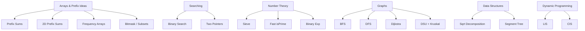

# 🚀 Competitive Programming Notebook & Topic Library


Welcome to my **Competitive Praogramming Notebook**.  
This repository is where I collect the algorithms, templates, and patterns that I actually use in contests  
(** Codeforces / AtCoder / online judges...**).

> 🧰 Think of this repo as a _battle-tested toolbox_, not a textbook.

---

## 📚 Navigation — How to Use This README

If you're here for something specific, use this mini “dictionary”:

- **For beginners**
  - [Quick Start & How to Use This Repo](#1-quick-start--how-to-use-this-repo)
  - [Beginner Advice & Training Philosophy](#3-beginner-advice--training-philosophy)
  - [Sublime Text Setup for Competitive Programming](#4-setting-up-sublime-text-for-competitive-programming)
  - [Roadmap & Learning Resources](#5-roadmap--learning-resources)
- **By topic (matches the `topics/` folder)**
  - [Prefix Sums (1D & 2D)](#21-prefix-sums-1d--2d)
  - [Frequency Arrays](#22-frequency-arrays)
  - [Binary Exponentiation](#23-binary-exponentiation)
  - [Binary Search (Answer & Index)](#24-binary-search-classic)
  - [Two Pointers / Sliding Window](#25-two-pointers--sliding-window)
  - [Bitmask & Recursive Subsets](#26-bitmask--recursive-subsets)
  - [Sieve of Eratosthenes & Fast `isPrime`](#27-sieve-of-eratosthenes--fast-isprime)
  - [Graph Traversal (BFS, DFS)](#28-graph-traversal-bfs--dfs)
  - [Shortest Paths — Dijkstra](#29-dijkstras-algorithm)
  - [Disjoint Set Union (DSU) & Kruskal MST](#210-dsu--kruskal-mst)
  - [Dynamic Programming: LIS & CIS](#211-dynamic-programming-lis--cis)
  - [Square Root Decomposition](#212-square-root-decomposition)
  - [Segment Tree (Range Max + Point Update)](#213-segment-tree-range-max--point-update)
- **Recruiters / reviewers**
  - [What This Repo Represents](#6-for-recruiters-coaches--reviewers)
- **Everyone**
  - [Arabic / Local CP Ecosystem](#7-arabic--local-cp-ecosystem-i-use)
  - [Global CP Resources](#8-global-competitive-programming-resources)
  - [Contributing & Customizing](#9-contributing--customizing)

---

## 🗂 Repository Structure

```text
.
├─ template1.cpp / template2.cpp   # My main C++ templates for contests
├─ topics/                         # Topic-wise implementations
│  ├─ 2D Prefix Sum.cpp
│  ├─ Prefix Sum.cpp
│  ├─ Binary Exponentiation.cpp
│  ├─ Binary Search (Classic).cpp
│  ├─ two pointers.cpp
│  ├─ frequency_array.cpp
│  ├─ Sieve of Eratosthenes.cpp
│  ├─ Is Prime Fast.cpp
│  ├─ bitmask subsets.cpp
│  ├─ recursion subsets.cpp
│  ├─ BFS.cpp
│  ├─ DFS.cpp
│  ├─ dijkstra.cpp
│  ├─ DSU.cpp
│  ├─ Kruskal MST.cpp
│  ├─ DP LIS.cpp
│  ├─ DP CIS.cpp
│  ├─ Square Root Decomposition.cpp
│  └─ segment tree max.cpp
└─ README.md                       # You are here
```

Each file is written with **contest usage** in mind: clean, iterative when possible, and focused on `O(n)` / `O(log n)` solutions.

---

## 🔭 Topic Map (Big Picture)


```mermaid
graph TD
  A[Arrays & Prefix Ideas] --> B[Prefix Sums]
  A --> C[2D Prefix Sums]
  A --> D[Frequency Arrays]
  A --> E[Bitmask / Subsets]

  F[Searching] --> G[Binary Search]
  F --> H[Two Pointers]

  I[Number Theory] --> J[Sieve]
  I --> K[Fast isPrime]
  I --> L[Binary Exp]

  M[Graphs] --> N[BFS]
  M --> O[DFS]
  M --> P[Dijkstra]
  M --> Q[DSU + Kruskal]

  R[Data Structures] --> S[Sqrt Decomposition]
  R --> T[Segment Tree]

  U[Dynamic Programming] --> V[LIS]
  U --> W[CIS]
```

---

## 1. Quick Start — How to Use This Repo

👶 **If you’re a beginner**

1. Clone the repo:
   ```bash
   git clone https://github.com/<your-username>/<your-repo>.git
   cd <your-repo>
   ```
2. Pick **one topic at a time** (for example `Prefix Sum.cpp`).
3. Open the file, read the comments, then:
   - Rewrite it yourself in a fresh file.
   - Run it on simple custom examples.
   - Use it in a real problem (from CSES / Codeforces / VJudge).
4. Keep a small notebook (or notes file) for:
   - New ideas you learned.
   - Classic bugs you made (off-by-one, overflow, etc.).

🧠 **If you’re already experienced**

- Treat this as:
  - My **implementation reference**.
  - A quick way to review how I structure code in contests.
- You can jump directly to the topic you care about using the navigation above.

🏢 **If you’re a recruiter / reviewer**

- This repository demonstrates:
  - Familiarity with the most common data structures / algorithms used in competitive programming.
  - Production-like C++ templates and repeatable patterns for solving problems under time pressure.

---

## 2. Topic Overview

### 2.1 Prefix Sums (1D & 2D)

Used for fast range sum queries.

#### Core Idea (1D)

```cpp
// a[1..n], pref[0] = 0
for (int i = 1; i <= n; ++i)
    pref[i] = pref[i - 1] + a[i];

auto range_sum = [&](int l, int r) {
    return pref[r] - pref[l - 1];
};
```

#### 2D Prefix Sum Formula

For a grid `pref[i][j]` storing sum over `(1,1)..(i,j)`:

```text
sum(x1..x2, y1..y2) =
    pref[x2][y2]
  - pref[x1-1][y2]
  - pref[x2][y1-1]
  + pref[x1-1][y1-1]
```

#### Where it shows up

- Many range-sum problems in **CSES**, **AtCoder ABC/ARC**, and Codeforces basic rounds.

#### Classic beginner mistakes (I made these too)

- Mixing 0-based and 1-based indexing → I now always write the formula **on paper** first.
- Using `int` when sum can exceed \(2^{31}-1\) → I always use `long long` for `pref`.
- Forgetting to initialize `pref[0] = 0`.

---

### 2.2 Frequency Arrays

Simple but insanely useful.

- You use an array `freq[value]` when the value range is small (`<= 1e6`, characters, etc.).
- Faster than `map`/`unordered_map` and easier to debug.

```cpp
const int MAXV = 1e6 + 5;
vector<int> freq(MAXV, 0);

for (int x : a) freq[x]++;

if (freq[value] > 0) {
    // value appears
}
```

**Typical uses**

- Counting occurrences, checking anagrams, counting pairs, offline constraints, etc.
- Many problems that look like “hash map” tasks are actually easier with a frequency array.

**Pitfalls**

- Not clearing between test cases.
- Underestimating max value and going out of bounds.

---

### 2.3 Binary Exponentiation

Fast \(a^b\) in \(O(\log b)\) time.

```cpp
long long binpow(long long a, long long e, long long mod) {
    long long res = 1 % mod;
    a %= mod;
    while (e > 0) {
        if (e & 1) res = (res * a) % mod;
        a = (a * a) % mod;
        e >>= 1;
    }
    return res;
}
```

**Where I use it**

- Modular arithmetic (`(a^b) mod m`) in number theory problems.
- Precomputing modular inverses in combination with factorials.

**Common bugs**

- Forgetting `a %= mod` at the start.
- Using `int` → overflow.
- Using negative base and forgetting to normalize it into `[0, mod)`.

---

### 2.4 Binary Search (Classic)

Whenever the answer is **monotonic** in some parameter, I immediately think “binary search on answer”.

```cpp
long long lo = L, hi = R, ans = L;
while (lo <= hi) {
    long long mid = lo + (hi - lo) / 2;
    if (good(mid)) {
        ans = mid;
        lo = mid + 1;  // or hi = mid - 1 depending on problem
    } else {
        hi = mid - 1;  // or lo = mid + 1
    }
}
```

**My checklist**

- Is `good(x)` monotonic?
- Are the bounds `L` and `R` correct and big enough?
- Do I update `ans` only on the correct branch?

I usually test with 5–10 manual values on paper before trusting the implementation.

---

### 2.5 Two Pointers / Sliding Window

Maintain a window `[l, r)` such that some condition holds:

```cpp
int n = a.size();
int l = 0;
long long cur = 0, best = 0;

for (int r = 0; r < n; ++r) {
    cur += a[r];
    while (cur > limit) {
        cur -= a[l];
        ++l;
    }
    best = max(best, cur);
}
```

**Typical problems**

- Longest subarray with sum ≤ X.
- Longest substring with at most K distinct characters.
- Merging sorted arrays.

**Bugs I met**

- Using `[l, r]` in my head but coding `[l, r)`.
- Forgetting to update answer after moving `l`.
- Forgetting to maintain additional info (like frequency of elements).

---

### 2.6 Bitmask & Recursive Subsets

These files cover both:

- full subset enumeration using **bitmasks**,
- and subset generation using **recursion**.

```cpp
for (int mask = 0; mask < (1 << n); ++mask) {
    for (int i = 0; i < n; ++i) {
        if (mask & (1 << i)) {
            // i is in subset
        }
    }
}
```

I use it for:

- Small \(n\) (\(n \le 20\)), typical DP on subsets, brute-force checks.
- Teaching myself how DP states grow when we add extra dimensions.

Main thing: always check `n` first. If `n` is 25 or 30, `2^n` will explode.

---

### 2.7 Sieve of Eratosthenes & Fast `isPrime`

The sieve gives all primes up to `N` in \(O(N \log\log N)\).

I use:

- `Sieve of Eratosthenes.cpp` for multiple queries.
- `Is Prime Fast.cpp` for one-off checks up to around `1e9`.

Most common bugs:

- Treating `0` and `1` as prime by mistake.
- Forgetting that sieve memory is `O(N)` — with `N = 1e8` it can be large.
- Overflow when checking `i * i <= n` with `int` instead of `long long`.

---

### 2.8 Graph Traversal (BFS & DFS)

```cpp
vector<vector<int>> g(n);
vector<int> dist(n, -1);
queue<int> q;

dist[src] = 0;
q.push(src);

while (!q.empty()) {
    int v = q.front(); q.pop();
    for (int to : g[v]) {
        if (dist[to] == -1) {
            dist[to] = dist[v] + 1;
            q.push(to);
        }
    }
}
```

- **BFS** → shortest path in unweighted graphs, level-order traversal.
- **DFS** → connected components, topological sort, cycle detection, bridges, etc.

Common bugs I ran into:

- Forgetting to clear `visited`/`dist` between test cases.
- Mixing 0-based and 1-based vertices.
- Creating directed edges when the graph is actually undirected (or the opposite).

---

### 2.9 Dijkstra’s Algorithm

Shortest paths in graphs with **non-negative weights**.

```cpp
using P = pair<long long,int>;
const long long INF = (1LL << 60);
vector<long long> dist(n, INF);
priority_queue<P, vector<P>, greater<P>> pq;

dist[src] = 0;
pq.push({0, src});

while (!pq.empty()) {
    auto [d, v] = pq.top(); pq.pop();
    if (d != dist[v]) continue;
    for (auto [to, w] : g[v]) {
        if (dist[to] > dist[v] + w) {
            dist[to] = dist[v] + w;
            pq.push({dist[to], to});
        }
    }
}
```

Things I always check:

- All weights are ≥ 0. If not, Dijkstra is invalid.  
- `dist` uses `long long`.
- I handle multiple edges and self-loops correctly.

---

### 2.10 DSU & Kruskal MST

**DSU.cpp** implements _Disjoint Set Union_ (Union-Find) with:

- Path compression.
- Union by size / rank.

**Kruskal MST.cpp** uses DSU to build a Minimum Spanning Tree:

1. Sort edges by weight.
2. For each edge `(u, v, w)`:
   - If `find_set(u) != find_set(v)` → take it and `union_sets(u, v)`.

DSU is also amazing for:

- Offline connectivity queries.
- “Add edges then answer queries” type problems.

Bugs that cost me points:

- Not initializing `parent[i] = i` for all vertices.
- Returning wrong root due to missing path compression.
- Forgetting that DSU is typically 0-based in my code but the problem is 1-based.

---

### 2.11 Dynamic Programming: LIS & CIS

- **DP LIS.cpp**
  - `O(n^2)` DP (easy to understand).
  - `O(n log n)` patience sorting version for real contests.

- **DP CIS.cpp**
  - _Common Increasing Subsequence_ between two sequences — combines LCS + LIS ideas.

These files are where I learned to:

- Separate **state** from **transition**.
- Visualize sequences and think about ordering constraints. 

---

### 2.12 Square Root Decomposition

```text
n elements  →  blocks of size B ≈ sqrt(n)
```

You precompute something (like sum / min / max) per block.

- Query = combine a few full blocks + some leftover elements.
- Point update = update one element + its block.

I use it when:

- Constraints are around `1e5`.
- Segment tree is overkill or time is short.

---

### 2.13 Segment Tree (Range Max + Point Update)

One of the core data structures in CP.

```cpp
struct SegTree {
    int n;
    vector<long long> seg;
    SegTree(int n) : n(n), seg(4*n, 0) {}

    void build(vector<long long> &a, int idx, int l, int r) {
        if (l == r) {
            seg[idx] = a[l];
            return;
        }
        int mid = (l + r) >> 1;
        build(a, idx<<1, l, mid);
        build(a, idx<<1|1, mid+1, r);
        seg[idx] = max(seg[idx<<1], seg[idx<<1|1]);
    }

    void update(int idx, int l, int r, int pos, long long val) {
        if (l == r) {
            seg[idx] = val;
            return;
        }
        int mid = (l + r) >> 1;
        if (pos <= mid) update(idx<<1, l, mid, pos, val);
        else update(idx<<1|1, mid+1, r, pos, val);
        seg[idx] = max(seg[idx<<1], seg[idx<<1|1]);
    }

    long long query(int idx, int l, int r, int ql, int qr) {
        if (qr < l || r < ql) return LLONG_MIN;
        if (ql <= l && r <= qr) return seg[idx];
        int mid = (l + r) >> 1;
        return max(
            query(idx<<1, l, mid, ql, qr),
            query(idx<<1|1, mid+1, r, ql, qr)
        );
    }
};
```

I treat segment tree as the “bridge” between normal arrays and truly advanced structures (Fenwick tree, lazy propagation, etc.).

---

## 3. Beginner Advice & Training Philosophy

This section is written for **new competitive programmers**, but even advanced contestants sometimes need the reminder.

Ideas here are influenced by well-known guides such as USACO Guide, CP-Algorithms, and Codeforces practice blogs.

### 3.1 Core Principles

1. **Think before you code**
   - Read the statement slowly.
   - Rewrite it in your own words.
   - Try tiny examples (n = 1, 2, 3…) on paper.

2. **Respect constraints**
   - If `n ≈ 2e5`, `O(n^2)` is usually impossible.
   - Learn to guess the intended complexity from input bounds.

3. **Learn ideas, not just code**
   - When you read a solution:
     - First, close the code.
     - Understand the idea using pen & paper.
     - Only then open the implementation.

4. **Upsolve seriously**
   - After every contest:
     - Solve 1–3 problems you missed.
     - Write down mistakes (logic / implementation / reading / time).

5. **Be consistent**
   - 30–60 minutes *daily* is better than a 6-hour grind once a week.

---

### 3.2 A Simple Training Plan (Beginner → Intermediate)

Suggested path (adapt it to your own pace):

1. **Basics**
   - Learn your language well (here: C++).
   - Be comfortable with arrays, `vector`, loops, functions, and STL basics.

2. **Phase 1 – Classic Techniques**
   - Prefix sums (1D, 2D)
   - Frequency counting
   - Binary search
   - Two pointers
   - Simple greedy

3. **Phase 2 – Graphs & DS**
   - BFS / DFS
   - Dijkstra
   - DSU
   - Basic MST (Kruskal / Prim)

4. **Phase 3 – Data Structures & DP**
   - Segment tree (sum / max)
   - Square root decomposition or Fenwick tree
   - Basic dynamic programming (knapsack, LIS, DP on paths).

Use the **roadmap link** in the next section as your main guide and this repo as your implementation notebook.

---

## 4. Setting Up Sublime Text for Competitive Programming

This is a compact version of how I configured Sublime Text for competitive programming, based on the FastOlympicCoding plugin and community blogs.

### 4.1 Tools You Need

- **C++ compiler**: `g++` (from MinGW / MSYS2 / WSL, depending on your OS).
- **Sublime Text 3 or 4**.
- **FastOlympicCoding** plugin for Sublime.
- (Optional but very useful) **FastOlympicCodingHook** + **Competitive Companion** browser extension for automatic test-case parsing. 

### 4.2 Install Sublime Text

1. Download from the official site.
2. Install like any normal editor.
3. Open it once to let it create its configuration folders.

### 4.3 Install `g++`

- On Windows, I prefer **MSYS2** or **MinGW-w64**.
- Make sure `g++` is accessible from the terminal:
  ```bash
  g++ --version
  ```

### 4.4 Install FastOlympicCoding

1. Open **Package Control** in Sublime.
2. Search for **“FastOlympicCoding”** (or `CppFastOlympicCoding`) and install.
3. Read the plugin README for detailed usage — shortcut keys, Test Manager, etc.  
   It supports:
   - Test-case management.
   - Stress testing.
   - Quick compilation & run.

### 4.5 Configure a C++ Build System

Example simple build system (you can customize):

```json
{
    "shell_cmd": "g++ -std=c++17 -O2 \"${file}\" -o \"${file_path}/${file_base_name}.exe\" && \"${file_path}/${file_base_name}.exe\" < input.txt",
    "file_regex": "^(..[^:]*):([0-9]+):?([0-9]+)?:? (.*)$",
    "working_dir": "${file_path}",
    "selector": "source.c++"
}
```

- Put this in `Tools → Build System → New Build System…`.
- Save as e.g. `CP.json`.

### 4.6 Optional: Automatic Test Parsing

- Install **Competitive Companion** browser extension.
- Install **FastOlympicCodingHook** (GitHub).
- Start the hook script so that when you click the *green plus* icon on Codeforces, test cases appear automatically in your Sublime project.

This setup lets you go from **problem page → code → running on samples** in a few seconds.

---

## 5. Roadmap & Learning Resources

### 🌟 The Most Important Resource

#### 📌 Complete CP Roadmap (all levels)

👉 **https://www.notion.so/Roadmap-29cf4abdd6528065a1f4fb69db1ce9ac**

This roadmap is my main “big picture” reference for:

- Level 1 → fundamentals.
- Level 2 → core topics.
- Level 3+ → advanced graphs, data structures, number theory, DP.

Use it together with:

- This notebook (implementations).
- The resources listed below.

---

### 5.1 Arabic / Local CP Ecosystem I Use

#### Teaching & Explanations

- **CodeAcademy PPU (YouTube)** – PPU’s official CP club  
  👉 https://www.youtube.com/@CodeAcademy-ppu/videos  
- **Mahmoud Ayman – Topic Explanations** – graphs, DP, greedy, number theory, etc.  
  👉 https://www.youtube.com/playlist?list=PLIOhtFzqhbbGroes7my01e8x6GtP71Ah4  

#### Sheets & Training Groups

- **Rokba Topic Sheets – Coach Hazem**  
  👉 https://vjudge.net/group/rokba  
- **Level 2 Training Group – Coach Mohamed Shareef**  
  👉 https://codeforces.com/group/2y52k0YLhL  
- **PCPC Training – Coach Abdelaziz**  
  👉 https://vjudge.net/group/pcpc_training  
- **Mahmoud Ayman Topic Contests**  
  👉 https://codeforces.com/group/9QrbarK7qH/contests  
- **Topic-Based Codeforces Group**  
  👉 https://codeforces.com/group/isP4JMZTix/contests  
- **PPU Graph Sheets – Coach Basel Ja'bari**  
  👉 https://vjudge.net/group/ppu-lvl3  
- **GSG Level 3 – Gaza Sky Geeks**  
  👉 https://codeforces.com/group/0Bl9bdDUwH/contests  
- **ACPC / Arab Regional Contests Group**  
  👉 https://codeforces.com/group/Rilx5irOux/contests  

#### Smart Training Tools

- **CP Training Tracker – Virtual CF Contests by Level**  
  👉 https://cp-training-tracker.vercel.app/training  

---

### 5.2 Global Competitive Programming Resources

Some of the best publicly available resources:

- **CP-Algorithms (e-maxx translation)** – algorithm reference for CP  
  👉 https://cp-algorithms.com 
- **USACO Guide** – structured roadmap + problems, not just for USACO  
  👉 https://usaco.guide  
- **CSES Problemset** – clean, well-structured problem list  
  👉 https://cses.fi/problemset  
- **Codeforces** – my main place for contests & practice  
  👉 https://codeforces.com  
- **AtCoder** – very high-quality contests with good editorials  
  👉 https://atcoder.jp  
- **VisuAlgo** – visualizations for many data structures / algorithms  
  👉 https://visualgo.net/en 
- **Competitive Programmer’s Handbook (free PDF)**  
  👉 https://usaco.guide/CPH.pdf 

Additionally, there are excellent Codeforces blogs about practice & mindset (Radewoosh, Um_nik, E869120, etc.).

---

## 6. For Recruiters, Coaches & Reviewers

This repository shows:

- Implementations of core algorithms and data structures that regularly appear in
  - ICPC-style contests,
  - Codeforces rounds,
  - AtCoder contests,
  - and typical technical interview questions.
- Ability to:
  - Design reusable templates under contest constraints.
  - Reason about complexity, corner cases, and memory usage.
  - Maintain consistent coding style (names, macros, structure).

Every `.cpp` here corresponds to something I’ve studied in theory and used to solve real problems.

---

## 7. Arabic / Local CP Ecosystem I Use

(Repeated here for convenience — this section is especially useful for students from the region.)

- CodeAcademy PPU (YouTube)  
- Mahmoud Ayman topics (YouTube)  
- Rokba / PCPC / PPU sheets on VJudge  
- Level 2 / GSG / ACPC / topic-based Codeforces groups  
- CP Training Tracker for smart, level-based virtual contests  

See [Roadmap & Learning Resources](#5-roadmap--learning-resources) above for direct links.

---

## 8. Global Competitive Programming Resources

Again, the short list:

- CP-Algorithms  
- USACO Guide  
- CSES Problemset  
- Codeforces  
- AtCoder  
- VisuAlgo  
- Competitive Programmer’s Handbook  

Use the roadmap + this notebook + these resources = a complete CP environment.

---

## 9. Contributing & Customizing

This repository is mainly my personal notebook, but you are welcome to:

- **Fork** it and adapt:
  - Add your own topics (Fenwick tree, lazy segment tree, LCA, flows, etc.).
  - Translate comments into your language.
  - Replace or extend templates.
- **Open issues / pull requests** if you spot:
  - Bugs,
  - Undefined behaviour,
  - Or better ways to write something.

If you’re using this repo to learn:

> Feel free to edit, break, and rebuild every file.  
> The best learning happens when you rewrite things in **your own style**.

---

## 🏁 Final Message

Competitive Programming is built on:

- clear logic  
- patience & discipline  
- structured practice  
- learning honestly from every mistake  

Use this repository as a toolbox, not something to memorize.

If this helped you:

- consider leaving a ⭐ on the repo,  
- and don’t forget us in your prayers 🌿  

**Happy coding, and good luck in your next contest! 💪🔥**  
