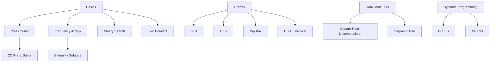
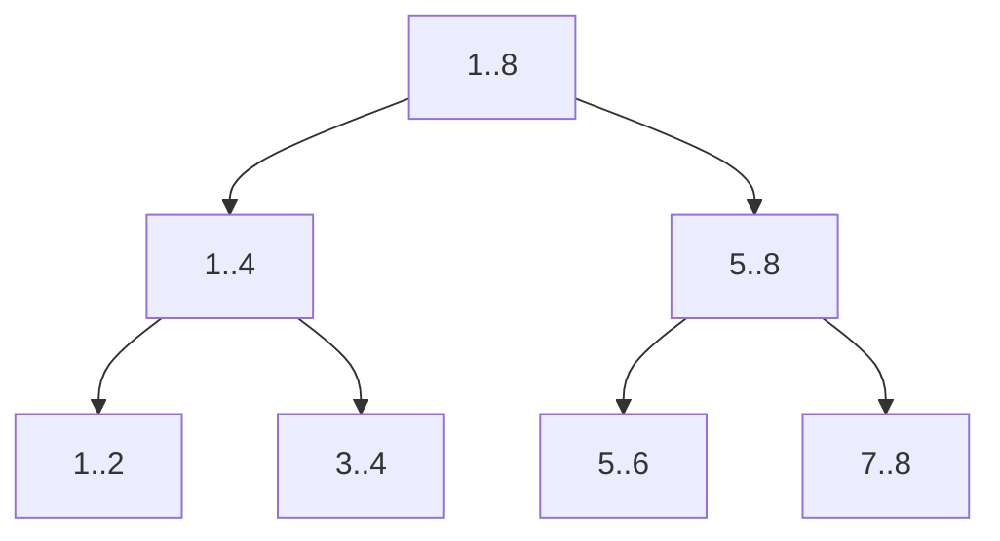

# 🚀 Competitive Programming Notebook & Topic Library

Welcome to my **Competitive Programming Notebook**.  
This repository is where I collect the algorithms, templates, and ideas that I actually use in contests (ICPC/ACPC/PCPC, Codeforces, AtCoder, etc.).

The goal of this repo is **not** to be a textbook.  
It is a *battle-tested toolbox* that I keep improving as I solve more problems.

---

## 📂 Repository Structure

```text
.
├─ template1.cpp / template2.cpp   # My main C++ templates for contests
├─ topics/                         # Topic-wise implementations
│  ├─ 2D Prefix Sum.cpp
│  ├─ Prefix Sum.cpp
│  ├─ Binary Exponentiation.cpp
│  ├─ Binary Search (Classic).cpp
│  ├─ two pointers.cpp
│  ├─ frequency_array.cpp
│  ├─ Sieve of Eratosthenes.cpp
│  ├─ Is Prime Fast.cpp
│  ├─ bitmask subsets.cpp
│  ├─ recursion subsets.cpp
│  ├─ BFS.cpp
│  ├─ DFS.cpp
│  ├─ dijkstra.cpp
│  ├─ DSU.cpp
│  ├─ Kruskal MST.cpp
│  ├─ DP LIS.cpp
│  ├─ DP CIS.cpp
│  ├─ Square Root Decomposition.cpp
│  └─ segment tree max.cpp
└─ README.md                       # You are here
```

Each file is written with **contest usage** in mind: clean, iterative where possible, and focused on `O(log n)` / `O(n)` solutions.

---

## 🧠 How I Treat Competitive Programming

Competitive Programming, for me, is about three things:

1. **Thinking clearly under pressure.**
2. **Knowing the right tools (algorithms/data structures).**
3. **Practicing in a structured, honest way.**

Some personal principles I try to follow:

- **Think before you code.** I always try a few small examples on paper before touching the keyboard.
- **Respect the constraints.** Time and memory limits tell you almost everything about the intended solution.
- **Upsolve seriously.** If I couldn’t solve it in a contest, I write down *why*, and I update this notebook if a new idea is useful.
- **Small daily habits > random long sessions.** 30–60 minutes every day beats 6 hours once a week.

---

## 🧩 Visual Overview of the Topics


```mermaid
graph TD
  A[Basics] --> B[Prefix Sums]
  A --> C[Frequency Arrays]
  A --> D[Binary Search]
  A --> E[Two Pointers]

  B --> F[2D Prefix Sums]
  C --> G[Bitmask / Subsets]

  H[Graphs] --> I[BFS]
  H --> J[DFS]
  H --> K[Dijkstra]
  H --> L[DSU + Kruskal]

  M[Data Structures] --> N[Square Root Decomposition]
  M --> O[Segment Tree]

  P[Dynamic Programming] --> Q[DP LIS]
  P --> R[DP CIS]
```

This README gives a **short conceptual explanation, pitfalls, and usage notes** for each topic that you’ll find in `topics/`.

> All implementations are in **C++17** and written for competitive environments.

---

## 🧱 1D & 2D Prefix Sums

### What They Solve

- Fast range sum queries in arrays and grids.
- Typical use cases:
  - `sum(l..r)` in `O(1)` after `O(n)` preprocessing.
  - 2D rectangles queries in `O(1)` after `O(n*m)` preprocessing.

### Core Idea (1D)

```cpp
// a[1..n], pref[0] = 0
for (int i = 1; i <= n; ++i)
    pref[i] = pref[i - 1] + a[i];

auto range_sum = [&](int l, int r) {
    return pref[r] - pref[l - 1];
};
```

### 2D Prefix Sum Formula

For a grid `pref[i][j]` as sum over rectangle `(1,1) .. (i,j)`:

```text
sum(x1..x2, y1..y2) =
  pref[x2][y2]
- pref[x1-1][y2]
- pref[x2][y1-1]
+ pref[x1-1][y1-1];
```

### Pitfalls I Had (and How I Fixed Them)

- **Off-by-one errors**: I now always use **1-based indexing** for prefix arrays.
- **Overflow**: never store prefix sums in `int` when values or `n` are large. Use `long long`.
- **Mixing inclusive/exclusive ranges**: I write the formula on paper *every time* before implementing.

### When to Reach for Prefix Sums

- You see many queries of type `sum(l,r)` or `sum over sub-rectangle`.
- Updates are rare or nonexistent (otherwise use BIT / Segment Tree).

---

## 🎯 Frequency Arrays

Used for counting occurrences in a **small value range** (like values ≤ 1e6 or alphabet letters).

### Typical Usage

- Counting frequencies, checking if two strings are anagrams, counting pairs with some condition, etc.
- Often used as a simple alternative to maps when the coordinate range is small.

### Common Mistakes

- **Not resetting** the frequency array between test cases.
- Using an array that is **too small** for the maximum value.
- Forgetting that indexing from `0` vs `1` changes the count positions.

To avoid bugs, I explicitly write:

```cpp
vector<int> freq(MAXV + 1, 0);
```

and clear only the indices I used when constraints are tight.

---

## ⚡ Binary Exponentiation

Fast exponentiation in `O(log exp)` time instead of `O(exp)`.

### Key Use Cases

- Modular exponentiation: `(a^b) % mod` for large `b`.
- Fast powering in matrix exponentiation, combinatorics, number theory.

### Implementation Pattern

```cpp
long long binpow(long long a, long long e, long long mod) {
    long long res = 1 % mod;
    a %= mod;
    while (e > 0) {
        if (e & 1) res = (res * a) % mod;
        a = (a * a) % mod;
        e >>= 1;
    }
    return res;
}
```

### Pitfalls

- Forgetting to do `a %= mod` at the start.
- Using `int` when values can exceed `2^31-1`.
- For non-modular pow, overflow can kill your solution silently.

---

## 🔍 Binary Search (Classic)

Whenever the answer is **monotonic** (true/false as we move), I try binary search first.

### Typical Patterns

- Search on **values** (answer) – e.g. minimum `x` satisfying a condition.
- Search on **index** in sorted arrays.

### My Standard Template (on Answer Space)

```cpp
long long lo = L, hi = R, ans = R;
while (lo <= hi) {
    long long mid = lo + (hi - lo) / 2;
    if (good(mid)) {       // condition holds
        ans = mid;
        hi = mid - 1;
    } else {
        lo = mid + 1;
    }
}
```

### Common Traps

- Infinite loops due to `mid` computation errors.
- Wrong initial bounds `L`, `R`.
- Condition `good(mid)` not actually monotonic.

I try a few manual checks like `good(L)` and `good(R)` before coding.

---

## 🪢 Two Pointers

Two indices that move over an array while maintaining a **window invariant**.  
Perfect for:

- Longest subarray with some property (sum ≤ X, distinct count ≤ K, etc.).
- Merging sorted arrays.
- Sliding window problems.

### Key Mindset

- Maintain some state for the current window `[l, r)`.
- Move `r` forward to expand, move `l` forward to shrink when invariant breaks.

### Frequent Bugs

- Off-by-one: is the window `[l, r]` or `[l, r)`? I choose one and stick to it.
- Forgetting to update the answer after moving `l`.
- Updating the frequency/state in the wrong order.

---

## 🧮 Bitmask Subsets & Recursive Subsets

These files contain two ways to iterate over subsets:

1. **Bitmask enumeration** – good when `n ≤ 20`.
2. **Recursive generation** – clearer to think about, especially when you need to maintain some extra state.

### Bitmask Pattern

```cpp
for (int mask = 0; mask < (1 << n); ++mask) {
    // check if i-th element is in the subset
    if (mask & (1 << i)) { /* ... */ }
}
```

### My Notes

- I always check constraints: if `n > 20–22`, full subset enumeration is usually too big.
- Many DP-on-subset tricks start from this basic enumeration.

---

## 🔢 Sieve of Eratosthenes & Fast `isPrime`

### Sieve

Precompute primes up to `N` in `O(N log log N)` time.

Used for:

- Prime queries.
- Factorization using smallest prime factor (SPF).
- Number-theory problems where multiple prime operations are needed.

### `isPrime`

For single checks with `x` up to around `1e9`, a simple trial division up to `sqrt(x)` with optimizations is usually enough.

### Pitfalls

- Not handling `0` and `1` correctly (they are not prime).
- Using `int` where `long long` is needed in multiplication.
- Forgetting that building the sieve itself takes time and memory.

---

## 🌳 Graph Traversal: BFS & DFS

### BFS (Breadth-First Search)

Used for:

- Shortest path in **unweighted** graphs.
- Level-by-level exploration.


> Visualization of BFS tree levels (source: Wikimedia Commons).

Typical BFS skeleton:

```cpp
vector<vector<int>> g(n);
vector<int> dist(n, -1);
queue<int> q;

dist[src] = 0;
q.push(src);

while (!q.empty()) {
    int v = q.front(); q.pop();
    for (int to : g[v]) {
        if (dist[to] == -1) {
            dist[to] = dist[v] + 1;
            q.push(to);
        }
    }
}
```

### DFS (Depth-First Search)

Used for:

- Connected components.
- Topological sort.
- Detecting cycles, bridges, articulation points (with extensions).

I usually use iterative DFS when recursion depth might explode, but for most contest constraints recursive DFS is fine with tail optimizations or manual stack tuning.

### Typical Mistakes

- Forgetting to reset `visited` / `dist` arrays between test cases.
- Building edges in the wrong direction in directed graphs.
- For BFS: pushing nodes multiple times because you mark them as visited *after* pushing instead of before.

---

## 🧭 Dijkstra’s Algorithm

Shortest path in graphs with **non-negative edge weights**.

### Complexity

- Using a binary heap (`priority_queue` in C++): `O((n + m) log n)`.

### Things I Pay Attention To

- All edge weights must be **≥ 0**, otherwise I switch to Bellman-Ford or other algorithms.
- Use `long long` for distance; adding weights can overflow `int` easily.
- I often store edges as `{to, weight}` pairs in adjacency lists.

```cpp
using P = pair<long long,int>;
vector<long long> dist(n, INF);
priority_queue<P, vector<P>, greater<P>> pq;

dist[src] = 0;
pq.push({0, src});

while (!pq.empty()) {
    auto [d, v] = pq.top(); pq.pop();
    if (d != dist[v]) continue; // stale
    for (auto [to, w] : g[v]) {
        if (dist[to] > dist[v] + w) {
            dist[to] = dist[v] + w;
            pq.push({dist[to], to});
        }
    }
}
```

---

## 🧩 Disjoint Set Union (DSU)

`DSU.cpp` implements **Union–Find** with path compression and union by size/rank.

### Where I Use DSU

- Connecting components in graphs.
- Kruskal’s MST.
- Offline queries (“add edges, then answer if two vertices are connected”).

### Key Operations

- `find_set(v)` – returns representative of the component.
- `union_sets(a, b)` – merges two components if they are different.

### Pitfalls from Practice

- Forgetting to compress paths: without it, complexity becomes too slow on big tests.
- Using recursion in `find_set` with extremely deep trees (iterative version can be safer in weird corner cases).
- Mixing 0-based and 1-based vertex indexing in DSU arrays.

I always test DSU with a tiny custom example before trusting it in a harder problem.

---

## 🌉 Kruskal’s Algorithm (Minimum Spanning Tree)

`Kruskal MST.cpp` combines **sorting edges + DSU**.

### Steps

1. Sort edges by weight.
2. For each edge `(u, v, w)` in ascending weight:
   - If `find_set(u) != find_set(v)` → take this edge, `union_sets(u, v)`.

### Notes

- Works only when the graph is undirected and connected (or gives MST forest otherwise).
- Perfect example of how DSU turns a conceptually simple algorithm into an efficient one.

---

## 📈 Dynamic Programming: LIS & CIS

### `DP LIS.cpp` – Longest Increasing Subsequence

I keep both:

- `O(n^2)` DP for clarity.
- `O(n log n)` patience sorting style approach for real contest usage.

Main applications:

- Sequence analysis, DP optimizations, reducing 2D problems to 1D LIS, etc.

### `DP CIS.cpp` – Common Increasing Subsequence

This is the **Longest Common Increasing Subsequence** between two arrays/strings.

- Combines ideas from **LCS** and **LIS**.
- Time complexity is usually higher than plain LIS; often `O(n^2 log n)` or similar depending on approach.

### What I Learned Working on LIS/CIS

- For LIS, the `tails` array invariant is extremely powerful, but easy to mess up if you don’t understand the logic behind it.
- These problems train you to think about **states** and **transitions** very carefully.

---

## 📦 Square Root Decomposition

`Square Root Decomposition.cpp` implements a decomposition of the array into blocks of size ≈ `sqrt(n)`.

### Use Cases

- Range queries with point updates when segment tree feels “too heavy”.
- Problems where `n` and `q` are around `1e5` and constraints are relaxed a bit.

### Typical Layout

- Block size `B = floor(sqrt(n))`.
- Each block keeps some aggregate (sum, min, max, frequency, …).

### Trade-offs

- Simpler to implement than segment tree.
- Usually slower but sometimes more than enough for contest constraints.

---

## 🌲 Segment Tree (Range Maximum Query + Point Update)

`segment tree max.cpp` implements a classic **iterative** or **recursive** segment tree that supports:

- Range maximum query in `O(log n)`.
- Point update in `O(log n)`.

### High-Level Concept

We build a binary tree over array indices; each node covers a range `[l, r]` and stores the maximum on that segment.


```mermaid
graph TD
  A[1..8] --> B[1..4]
  A --> C[5..8]
  B --> D[1..2]
  B --> E[3..4]
  C --> F[5..6]
  C --> G[7..8]
```

### Things I Pay Attention To

- Neutral element for maximum is `-INF`, for sum is `0`, etc.
- Take care to avoid mixing **0-based** and **1-based** indices.
- For heavy updates or lazy range updates, I extend this implementation with **lazy propagation**.

Segment trees are one of the core tools that separate mid-level from advanced competitive programmers.

---

## 🚦 Two Classic Templates Included

- `template1.cpp` – more compact, for speed in contests.
- `template2.cpp` – slightly more verbose, good for debugging and learning.

Both include:

- Fast I/O setup.
- Common typedefs and helper functions.
- Debug macros that I can disable with a single flag when submitting.

---

## 📚 Recommended External Resources

I constantly refer to a few high-quality resources while learning and practicing:

- **CP-Algorithms** – encyclopedia of algorithms used in CP.  
  <https://cp-algorithms.com/>
- **USACO Guide – CP Resources** – curated list of books, websites, and problem sets.  
  <https://usaco.guide/general/resources-cp>
- **CSES Problemset** – clean, well-structured problemset for building fundamentals.  
  <https://cses.fi/problemset/>
- **Codeforces** – main platform I use for contests & virtual participation.  
  <https://codeforces.com/>
- **AtCoder** – high-quality contests with clear statements and strong tasks.  
  <https://atcoder.jp/>

These resources + this notebook are basically my whole CP “universe”.

---

## ✅ Final Notes

This repository is a living notebook. As I solve more problems, I:

- **Refactor** implementations to be cleaner and safer.
- **Add comments** when I discover a new trick or a common bug.
- **Extend topics** with more advanced variants (lazy segment trees, 0–1 BFS, binary lifting, etc.).

If you are reading this as a recruiter, coach, or teammate:

- Every file here is something I have studied carefully and used to solve real problems.
- I treat this notebook as my **personal CP knowledge base**, not just random pasted code.

If you are another competitive programmer:

- Feel free to use anything here as inspiration for your own notebook.
- The best way to learn these topics is still the same: **read → implement → debug → solve a lot of problems**.

Happy coding and good luck in your next contest! 💪🔥
