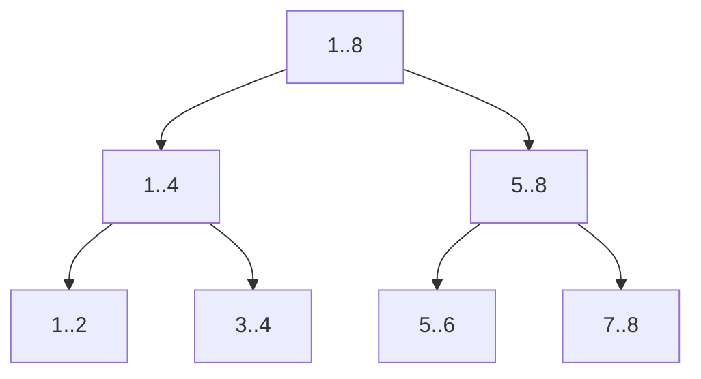

# 🚀 Competitive Programming Notebook & Topic Library

Welcome to my **Competitive Programming Notebook**.  
This repository is where I collect the algorithms, templates, and ideas that I actually use in contests (ICPC/ACPC/PCPC, Codeforces, AtCoder, etc.).

The goal of this repo is **not** to be a textbook.  
It is a *battle-tested toolbox* that I keep improving as I solve more problems.

---

## 📘 How to Use This Notebook

This README is designed so that **different people can get value quickly**:

- 🟢 **If you are a beginner**  
  Follow the **Reading Roadmap** below, start from the basics, and use the links in the *Quick Navigation* to jump to each topic.

- 🔵 **If you are an experienced competitive programmer**  
  Use the **Quick Navigation / Topic Index** to jump directly to the topic you care about (Segment Tree, DSU, Dijkstra, etc.).

- 🟣 **If you are a recruiter / interviewer**  
  The `topics/` folder plus this README show how I organize my CP knowledge:  
  clean implementations, clear mental models, and notes about pitfalls from real problems I solved.

---

## 🗺️ Reading Roadmap (Recommended Order)


```mermaid
graph LR
  A[Start Here] --> B(Basics & Implementation)
  B --> C(Prefix Sums & Frequency Arrays)
  C --> D(Binary Search & Two Pointers)
  D --> E(Graph Basics: BFS & DFS)
  E --> F(Shortest Paths & MST: Dijkstra, DSU, Kruskal)
  F --> G(Dynamic Programming: LIS & CIS)
  G --> H(Data Structures: Square Root Decomposition)
  H --> I(Segment Tree & Advanced Range Queries)
```

**Suggested workflow** for each topic:

1. Jump to the topic section from the **Quick Navigation** below.  
2. Read the short conceptual explanation + pitfalls.  
3. Open the corresponding file in `topics/` (for example `topics/segment tree max.cpp`).  
4. Practice problems on Codeforces / CSES using the external resources in the later sections.

---

## 📚 Quick Navigation (Topic Index)

> Click a link to jump directly to the section you want.

### Repository & Overview

- [Repository Overview](#-repository-overview)
- [Prefix Sums (1D & 2D)](#-1d--2d-prefix-sums)
- [Frequency Arrays](#-frequency-arrays)
- [Binary Exponentiation](#-binary-exponentiation)
- [Binary Search](#-binary-search-classic)
- [Two Pointers](#-two-pointers)
- [Bitmask / Recursive Subsets](#-bitmask-subsets--recursive-subsets)
- [Prime Sieve & Fast isPrime](#-sieve-of-eratosthenes--fast-isprime)
- [Graph Traversal (BFS & DFS)](#-graph-traversal-bfs--dfs)
- [Dijkstra’s Algorithm](#-dijkstras-algorithm)
- [Disjoint Set Union (DSU)](#-disjoint-set-union-dsu)
- [Kruskal’s MST](#-kruskals-algorithm-minimum-spanning-tree)
- [Dynamic Programming: LIS & CIS](#-dynamic-programming-lis--cis)
- [Square Root Decomposition](#-square-root-decomposition)
- [Segment Tree](#-segment-tree-range-maximum-query--point-update)
- [Contest Templates](#-two-classic-templates-included)
- [Global CP Resources](#-recommended-global-cp-resources)
- [Arabic / Local CP Resources](#-arabic--local-cp-resources-i-use)
- [Beginner Advice](#-advice-for-beginners-starting-cp)
- [Advanced / Recruiter Notes](#-advice-for-advanced-cp-practitioners--recruiters)
- [Final Message](#-final-message)

---

## 📂 Repository Overview

```text
.
├─ template1.cpp / template2.cpp   # My main C++ templates for contests
├─ topics/                         # Topic-wise implementations
│  ├─ 2D Prefix Sum.cpp
│  ├─ Prefix Sum.cpp
│  ├─ Binary Exponentiation.cpp
│  ├─ Binary Search (Classic).cpp
│  ├─ two pointers.cpp
│  ├─ frequency_array.cpp
│  ├─ Sieve of Eratosthenes.cpp
│  ├─ Is Prime Fast.cpp
│  ├─ bitmask subsets.cpp
│  ├─ recursion subsets.cpp
│  ├─ BFS.cpp
│  ├─ DFS.cpp
│  ├─ dijkstra.cpp
│  ├─ DSU.cpp
│  ├─ Kruskal MST.cpp
│  ├─ DP LIS.cpp
│  ├─ DP CIS.cpp
│  ├─ Square Root Decomposition.cpp
│  └─ segment tree max.cpp
└─ README.md                       # You are here
```

Each file is written with **contest usage** in mind: clean, iterative where possible, and focused on `O(log n)` / `O(n)` solutions.

---

## 🧠 How I Think About Competitive Programming

Competitive Programming, for me, is about three things:

1. **Thinking clearly under pressure.**
2. **Knowing the right tools (algorithms/data structures).**
3. **Practicing in a structured, honest way.**

Some personal principles I try to follow:

- **Think before you code.** Try small examples on paper before touching the keyboard.
- **Respect the constraints.** Time and memory limits tell you almost everything about the intended solution.
- **Upsolve seriously.** If I couldn’t solve it in a contest, I write down *why*, and I update this notebook if a new idea is useful.
- **Small daily habits > random long sessions.** 30–60 minutes every day beats 6 hours once a week.

---

## 🧭 Topic Map (High-Level Visual)


```mermaid
graph TD
  A[Core Basics] --> B[Prefix Sums]
  A --> C[Frequency Arrays]
  A --> D[Binary Search]
  A --> E[Two Pointers]

  B --> F[2D Prefix Sums]
  C --> G[Bitmask / Subsets]

  H[Graphs] --> I[BFS]
  H --> J[DFS]
  H --> K[Dijkstra]
  H --> L[DSU + Kruskal]

  M[Data Structures] --> N[Square Root Decomposition]
  M --> O[Segment Tree]

  P[Dynamic Programming] --> Q[DP LIS]
  P --> R[DP CIS]
```

This map is a rough mental model of how these topics connect in real CP problems.

---

## 🧱 1D & 2D Prefix Sums

### What They Solve

- Fast range sum queries in arrays and grids.
- Typical use cases:
  - `sum(l..r)` in `O(1)` after `O(n)` preprocessing.
  - 2D rectangular queries in `O(1)` after `O(n * m)` preprocessing.

### Core Idea (1D)

```cpp
// a[1..n], pref[0] = 0
for (int i = 1; i <= n; ++i)
    pref[i] = pref[i - 1] + a[i];

auto range_sum = [&](int l, int r) {
    return pref[r] - pref[l - 1];
};
```

### 2D Prefix Sum Formula

For a grid `pref[i][j]` as sum over rectangle `(1,1) .. (i,j)`:

```text
sum(x1..x2, y1..y2) =
  pref[x2][y2]
- pref[x1-1][y2]
- pref[x2][y1-1]
+ pref[x1-1][y1-1];
```

### Pitfalls I Hit (and How I Fixed Them)

- **Off-by-one errors** → I now always use **1-based indexing** for prefix arrays and keep `pref[0] = 0`.
- **Overflow** → never store prefix sums in `int` when values or `n` are large. I use `long long`.
- **Inclusive/exclusive confusion** → I write the formula on paper every time before implementing.

### When to Use

- Many queries of type `sum(l,r)` or `sum over sub-rectangle`.
- Updates are rare or nonexistent (otherwise a BIT or Segment Tree is usually better).

---

## 🎯 Frequency Arrays

Used for counting occurrences in a **small value range** (like values ≤ 1e6 or alphabet letters).

### Typical Usage

- Counting frequencies, checking if two strings are anagrams, counting pairs with conditions, etc.
- Often used as a simple alternative to maps when the coordinate range is small.

### Common Mistakes

- **Not resetting** the frequency array between test cases.
- Using an array that is **too small** for the maximum value.
- Confusing 0-based vs 1-based indexing.

To avoid bugs, I explicitly write:

```cpp
vector<int> freq(MAXV + 1, 0);
```

and clear only the indices I actually used when constraints are tight.

---

## ⚡ Binary Exponentiation

Fast exponentiation in `O(log exp)` instead of `O(exp)`.

### Key Use Cases

- Modular exponentiation: `(a^b) % mod` for large `b`.
- Fast powering in matrix exponentiation, combinatorics, number theory.

### Implementation Pattern

```cpp
long long binpow(long long a, long long e, long long mod) {
    long long res = 1 % mod;
    a %= mod;
    while (e > 0) {
        if (e & 1) res = (res * a) % mod;
        a = (a * a) % mod;
        e >>= 1;
    }
    return res;
}
```

### Pitfalls

- Forgetting `a %= mod` at the start.
- Using `int` where `long long` is needed.
- For non-modular pow, silent overflow if you’re not careful with limits.

---

## 🔍 Binary Search (Classic)

Whenever the answer is **monotonic** (true/false as we move), I consider binary search first.

### Typical Patterns

- Search on **values** (answer) – e.g. minimum `x` satisfying a condition `good(x)`.
- Search on **index** in sorted arrays.

### Standard Template (on Answer Space)

```cpp
long long lo = L, hi = R, ans = R;
while (lo <= hi) {
    long long mid = lo + (hi - lo) / 2;
    if (good(mid)) {       // condition holds
        ans = mid;
        hi = mid - 1;
    } else {
        lo = mid + 1;
    }
}
```

### Common Traps

- Infinite loops due to wrong `mid` computation or update.
- Wrong initial bounds `L`, `R`.
- `good(mid)` not actually monotonic.

I usually manually check `good(L)` and `good(R)` before coding the search.

---

## 🪢 Two Pointers

Two indices that move over an array while maintaining a **window invariant**.

### Where I Use It

- Longest subarray with some property (sum ≤ X, distinct count ≤ K, etc.).
- Merging sorted arrays.
- Sliding window problems over strings or arrays.

### Mindset

- Maintain some state for the current window `[l, r)`.
- Move `r` forward to expand, move `l` forward to shrink when the invariant breaks.

### Frequent Bugs

- Off-by-one: is the window `[l, r]` or `[l, r)`? I decide once and stay consistent.
- Forgetting to update the answer after moving `l`.
- Updating the frequency/state in the wrong order, causing negative counts.

---

## 🧮 Bitmask Subsets & Recursive Subsets

Two standard ways to iterate over subsets:

1. **Bitmask enumeration** – good when `n ≤ 20`.
2. **Recursive generation** – clearer when you need to maintain extra state.

### Bitmask Pattern

```cpp
for (int mask = 0; mask < (1 << n); ++mask) {
    // check if i-th element is in the subset
    if (mask & (1 << i)) { /* ... */ }
}
```

### Notes

- Always check constraints: if `n > 20–22`, full subset enumeration is usually too big.
- Many DP-on-subset tricks start from this basic enumeration.

---

## 🔢 Sieve of Eratosthenes & Fast `isPrime`

### Sieve

Precomputes primes up to `N` in `O(N log log N)` time. Great for multiple prime queries and factorization tasks. citeturn1search29

### `isPrime`

For single checks up to around `1e9`, a simple trial division up to `sqrt(x)` can be enough when used carefully.

### Typical Pitfalls

- Handling `0` and `1` incorrectly (they are *not* prime).
- Using `int` where `long long` is needed for `i * i` or `mid * mid`.
- Forgetting the memory cost of very large sieves.

---

## 🌳 Graph Traversal: BFS & DFS

### BFS (Breadth-First Search)

Used for:

- Shortest path in **unweighted** graphs.
- Level-by-level exploration and distance layers. citeturn1search22

```cpp
vector<vector<int>> g(n);
vector<int> dist(n, -1);
queue<int> q;

dist[src] = 0;
q.push(src);

while (!q.empty()) {
    int v = q.front(); q.pop();
    for (int to : g[v]) {
        if (dist[to] == -1) {
            dist[to] = dist[v] + 1;
            q.push(to);
        }
    }
}
```

### DFS (Depth-First Search)

Used for:

- Connected components.
- Topological sort.
- Detecting cycles, bridges, articulation points (with extra logic).

I use recursive DFS for most problems, and switch to an explicit stack when recursion depth might be too large.

### Common Mistakes

- Not resetting `visited` / `dist` between test cases.
- Building edges in the wrong direction in directed graphs.
- For BFS: pushing nodes multiple times because you mark them as visited *after* pushing.

---

## 🧭 Dijkstra’s Algorithm

Shortest path in graphs with **non-negative edge weights**. citeturn1search0

### Complexity

- Using a binary heap (`priority_queue` in C++): `O((n + m) log n)`.

### Key Details

- All edge weights must be **≥ 0**; otherwise, consider Bellman-Ford or other algorithms.
- Use `long long` for distances to avoid overflow.
- Store edges as `{to, weight}` pairs in adjacency lists.

```cpp
using P = pair<long long,int>;
vector<long long> dist(n, INF);
priority_queue<P, vector<P>, greater<P>> pq;

dist[src] = 0;
pq.push({0, src});

while (!pq.empty()) {
    auto [d, v] = pq.top(); pq.pop();
    if (d != dist[v]) continue; // stale
    for (auto [to, w] : g[v]) {
        if (dist[to] > dist[v] + w) {
            dist[to] = dist[v] + w;
            pq.push({dist[to], to});
        }
    }
}
```

---

## 🧩 Disjoint Set Union (DSU)

`DSU.cpp` implements **Union–Find** with path compression and union by size/rank. citeturn1search0

### Where I Use DSU

- Connecting components in graphs.
- Kruskal’s MST.
- Offline connectivity queries.

### Core Operations

- `find_set(v)` – returns representative of the component.
- `union_sets(a, b)` – merges two components if they are different.

### Pitfalls from Practice

- Forgetting path compression → DSU becomes too slow on big test cases.
- Recursion depth in weird, adversarial trees → iterative `find_set` can be safer.
- Mixing 0-based and 1-based indices in DSU arrays.

I usually test DSU with a tiny hand-crafted example before trusting it in a harder problem.

---

## 🌉 Kruskal’s Algorithm (Minimum Spanning Tree)

`Kruskal MST.cpp` combines **sorting edges + DSU**. citeturn1search0

### Steps

1. Sort edges by weight.
2. For each edge `(u, v, w)` in ascending order:
   - If `find_set(u) != find_set(v)` → take this edge and `union_sets(u, v)`.

### Notes

- Works on undirected graphs; gives an MST (or forest if the graph isn’t fully connected).
- Great example of a greedy algorithm + DSU.

---

## 📈 Dynamic Programming: LIS & CIS

### `DP LIS.cpp` – Longest Increasing Subsequence

I keep both:

- `O(n^2)` DP for clarity.
- `O(n log n)` patience sorting–style version for real contests.

Applications:

- Sequence analysis, DP optimizations, and reducing 2D problems to 1D LIS.

### `DP CIS.cpp` – Common Increasing Subsequence

The **Longest Common Increasing Subsequence** between two arrays/strings.

- Combines ideas from **LCS** and **LIS**.
- Typically heavier complexity than standard LIS.

### Lessons Learned

- For LIS, understanding the invariant of the `tails` array is crucial.
- These problems train careful thinking about **states** and **transitions**, which generalizes to many other DP problems. citeturn1search10

---

## 📦 Square Root Decomposition

`Square Root Decomposition.cpp` partitions the array into blocks of size ≈ `sqrt(n)`.

### Use Cases

- Range queries + point updates when segment tree is overkill.
- `n` and number of queries around `1e5` with less strict time limits.

### Pattern

- Block size `B = floor(sqrt(n))`.
- Each block stores an aggregate (sum, min, max, frequency, …).

### Trade-offs

- Easier to implement than a segment tree.
- Usually slower, but absolutely fine for many practical constraints.

---

## 🌲 Segment Tree (Range Maximum Query + Point Update)

`segment tree max.cpp` implements a classic tree over array segments. citeturn1search9turn1search28

### What It Supports

- Range maximum query in `O(log n)`.
- Point update in `O(log n)`.

### Visual Structure


```mermaid
graph TD
  A[1..8] --> B[1..4]
  A --> C[5..8]
  B --> D[1..2]
  B --> E[3..4]
  C --> F[5..6]
  C --> G[7..8]
```

Each node stores information about a segment `[l, r]`. We merge children to get the parent value (e.g., `max(left, right)` for range maximum).

### Implementation Notes

- Neutral element for maximum is `-INF`, for sum is `0`, etc.
- Be consistent with indexing (0-based vs 1-based).
- For heavy range updates, I extend the base implementation with **lazy propagation**.

Segment trees are one of the main structures that distinguish intermediate from advanced competitive programmers.

---

## 🚦 Two Classic Templates Included

- `template1.cpp` – compact template for fast writing in contests.
- `template2.cpp` – slightly more verbose and easier to debug.

Both include:

- Fast I/O setup.
- Common typedefs and helper functions.
- Debug macros that can be disabled with a single flag when submitting.

---

## 📚 Recommended Global CP Resources

These are the primary global references I rely on and recommend strongly:

- **CP-Algorithms** – open-source encyclopedia of algorithms and data structures used in CP. citeturn1search0turn1search24  
  <https://cp-algorithms.com/>
- **USACO Guide – General CP Resources** – curated list of books, judges, and practice tips. citeturn1search1turn1search20  
  <https://usaco.guide/general/resources-cp>
- **CSES Problem Set** – a comprehensive, high-quality problem set for learning algorithms. citeturn1search2turn1search7turn1search12  
  <https://cses.fi/problemset/>
- **Codeforces** – my main contest platform and source of virtual contests.  
  <https://codeforces.com/>
- **AtCoder** – regular high-quality contests with clean statements and strong problem design.  
  <https://atcoder.jp/>

These plus this notebook cover most of my competitive programming ecosystem.

---

## 🇵🇸 Arabic / Local CP Resources I Use

### Teaching & Explanations

- **CodeAcademy PPU (YouTube)** – PPU’s official competitive programming club channel.  
  👉 <https://www.youtube.com/@CodeAcademy-ppu/videos>
- **Mahmoud Ayman – Topic Explanations** – detailed playlists covering graphs, DP, greedy, and more.  
  👉 <https://www.youtube.com/playlist?list=PLIOhtFzqhbbGroes7my01e8x6GtP71Ah4>

### Sheets & Training Groups

- **Rokba Topic Sheets – Coach Hazem**  
  👉 <https://vjudge.net/group/rokba>
- **Level 2 Training Group – Coach Mohamed Shareef**  
  👉 <https://codeforces.com/group/2y52k0YLhL>
- **PCPC Training – Coach Abdelaziz**  
  👉 <https://vjudge.net/group/pcpc_training>
- **Mahmoud Ayman Topic Contests**  
  👉 <https://codeforces.com/group/9QrbarK7qH/contests>
- **Topic-Based Codeforces Group**  
  👉 <https://codeforces.com/group/isP4JMZTix/contests>
- **PPU Graph Sheets – Coach Basel Ja'bari**  
  👉 <https://vjudge.net/group/ppu-lvl3>
- **GSG Level 3 – Gaza Sky Geeks**  
  👉 <https://codeforces.com/group/0Bl9bdDUwH/contests>
- **ACPC / Arab Regional Contests Group**  
  👉 <https://codeforces.com/group/Rilx5irOux/contests>

### Smart Training Tools

- **CP Training Tracker – Virtual Codeforces Contests by Level**  
  👉 <https://cp-training-tracker.vercel.app/training>

> When I pick a topic from `topics/` (for example `BFS.cpp` or `segment tree max.cpp`),  
> I often combine the implementation here with a **video or sheet from these resources**.  
> Code + explanation + practice problems = much deeper understanding.

---

## 🎓 Advice for Beginners Starting CP

If you are new to competitive programming and landed on this repo, here is how I would start **from zero**:

1. **Learn basic C++ and STL**  
   - Variables, loops, functions.
   - `vector`, `string`, `pair`, `map`, `set`, and simple I/O. citeturn1search11turn1search20  

2. **Start with implementation & easy problems**  
   - Use Codeforces Div. 3 / Div. 4 problems and the CSES Introductory Problems. citeturn1search16turn1search2turn1search17  
   - As you solve, come back here and read:
     - [`Prefix Sum.cpp`](#-1d--2d-prefix-sums)
     - [`frequency_array.cpp`](#-frequency-arrays)
     - [`two pointers.cpp`](#-two-pointers)

3. **Follow a structured topic order**  
   Rough progression:
   1. Implementation, math basics, prefix sums, frequency arrays.
   2. Binary search and two pointers.
   3. Sorting, basic greedy.
   4. Graph basics (BFS/DFS).
   5. Shortest paths & MST (Dijkstra, DSU, Kruskal).
   6. Introductory DP (LIS, knapsack-style problems).
   7. Data structures (segment tree, Fenwick tree, etc.).

4. **For each topic**
   - Read the short explanation in this README.
   - Open the corresponding `topics/<name>.cpp` implementation.
   - Watch 1–2 explanations from the global or Arabic resources above.
   - Solve 3–5 problems using that idea on Codeforces / CSES.

5. **Upsolve after every contest**  
   - Try to solve problems you could not finish in time.  
   - When a new trick appears, add code or comments in your own notebook (or fork of this repo).

6. **Be patient and consistent**  
   - Improvement is not linear. Some weeks you feel stuck, then suddenly many ideas click together.
   - Focus on building strong thinking habits instead of chasing rating alone.

---

## 🧱 Advice for Advanced CP Practitioners / Recruiters

If you are already experienced in CP (or you are reviewing this as a recruiter / coach):

- Each topic in `topics/` is something I have *personally used* to solve real contest problems.
- Implementations are written to be:
  - clean and reusable,
  - careful about typical pitfalls (overflow, off-by-one, complexity),
  - easy to extend for advanced variants (lazy segment trees, 0–1 BFS, divide-and-conquer DP, etc.). citeturn1search5turn1search28  
- This notebook represents how I:
  - structure my knowledge by topic,
  - keep reference implementations handy,
  - and continuously refine them as I learn from editorials and harder problems.

For technical interviews, this repo also reflects how I approach:
- designing abstractions (DSU, segment tree, templates),  
- reasoning about complexity and constraints,  
- and documenting mental models instead of just dropping code.

---

## 🏁 Final Message

Competitive Programming is built on:

- clear logic,  
- patience,  
- structured practice,  
- and learning from every mistake.  

Use this repository as your **toolbox**:  
read the code, change it, break it, fix it, and apply it to real problems.

> If this notebook was useful to you, consider leaving a ⭐ on the repo –  
> and please **keep me in your prayers**. 🌿  
>  
> Happy coding, and good luck in your next contest! 💪🔥
